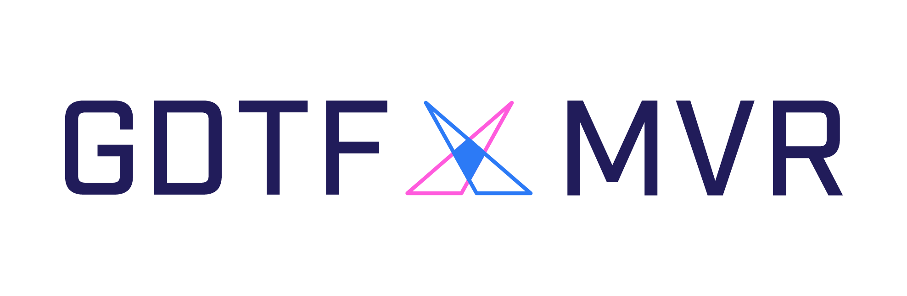

# DIN SPEC 15800  General Device Type Format (GDTF) and DIN SPEC 15801 My Virtual Rig (MVR) File Format description

The General Device Type Format (GDTF) creates a unified data exchange definition for the operation of devices used in the entertainment industry. By creating a manufacturer-supported, unified standard, customers/users of lighting control systems, CAD systems, and pre-visualizers benefit by knowing the tools they use to perform their job will work consistently and dependably. The file format is developed using open source formats, and manufacturers in the entertainment design, production, and performance industries are welcome to use this open source technology.

The GDTF file format is standardized in [DIN SPEC 15800](https://www.beuth.de/en/technical-rule/din-spec-15800/349717520). The current version is: `DIN SPEC 15800:2022-02`
The MVR file format is standardized in [DIN SPEC 15801](https://www.beuth.de/en/technical-rule/din-spec-15801/373968511). The current version is: `DIN SPEC 15801:2023-12`

## About this repo 

This repo contain the [MVR](mvr-spec.md) and [GDTF](gdtf-spec.md) spec in markdown format for convenience. 

The [main](https://github.com/mvrdevelopment/spec/tree/main) branch contains the latest specs for the MVR and GDTF spec.

The [next](https://github.com/mvrdevelopment/spec/tree/next) branch contains the current approved changes for the next DIN SPEC version. 

The folder [proposal](https://github.com/mvrdevelopment/spec/tree/main/proposal) contains the proposals that where considered for the given version of GDTF and MVR. This contains the changes to the GDTF/MVR spec together with a description of the changes. Normally this also has information about the motivation of the change, considered alternatives and examples.

The folder [examples](https://github.com/mvrdevelopment/spec/tree/main/examples) contain some examples of usage of the GDTF file format

The folder [meshes](https://github.com/mvrdevelopment/spec/tree/main/meshes) contain the default meshes that are used by the GDTF spec.

## How we work in the spec

We use [Releases](https://github.com/mvrdevelopment/spec/releases) to tag versions of the GDTF/MVR spec. We tag the current DIN SPEC version as [latest](https://github.com/mvrdevelopment/spec/releases/latest). 
This releases will be created out of the `main` branch.

Creating a DIN SPEC takes some time. To get new features and definition to the GDTF/MVR specs faster, we also create intermediate version of GDTF and MVR so that companies can start implementing this. We tag this version as `pre-release`, but give them a version number so that this can be used in production. When a new DIN SPEC is released, this changes will be come part of it.
This releases will be created out of the `next` branch.

Changes that we will do have their own branch and pull request while we actively working on them. When they have been approved by the group we will merge this changes into the `next` branch. 

## How to get involved
To gain commenting access, please email your GitHub username to info@gdtf-share.com, together with brief introduction about who you represent.
