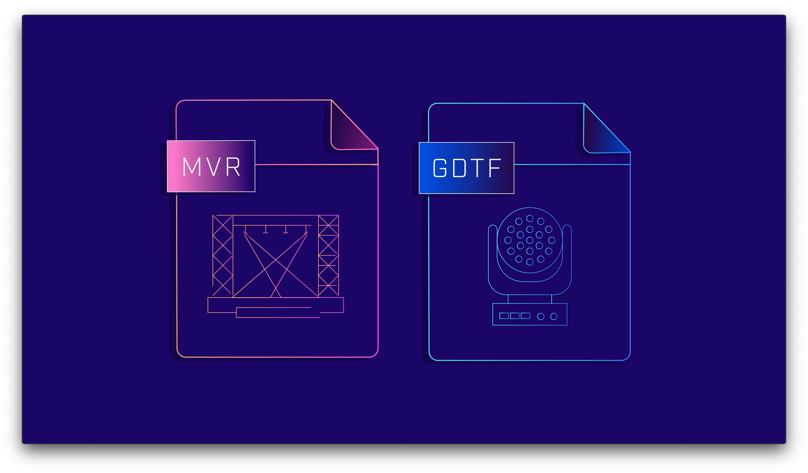

# DIN SPEC 15800  General Device Type Format (GDTF) and My Virtual Rig (MVR) File Format description

The General Device Type Format (GDTF) creates a unified data exchange definition for the operation of intelligent luminaires, such as moving lights. By creating a manufacturer-supported, unified standard, customers/users of lighting control systems, CAD systems, and pre-visualizers benefit by knowing the tools they use to perform their job will work consistently and dependably. The file format is developed using open source formats, and luminaire manufacturers in the entertainment design, production, and performance industries are welcome to use this open source technology.

The GDTF file format is standartisied in [DIN SPEC 15800](https://www.beuth.de/de/technische-regel/din-spec-15800/324748671).
