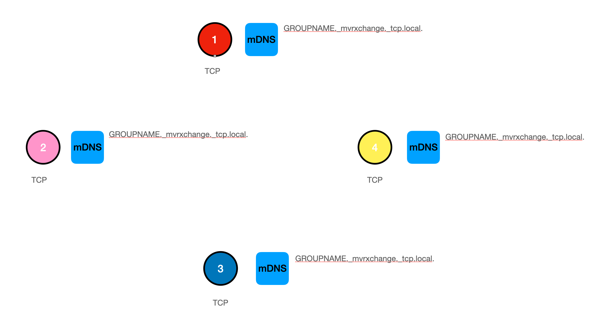
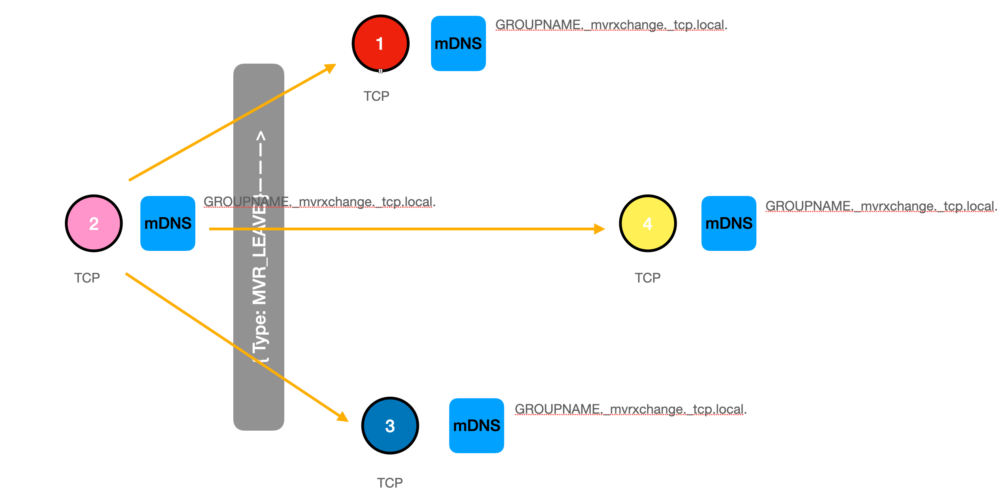
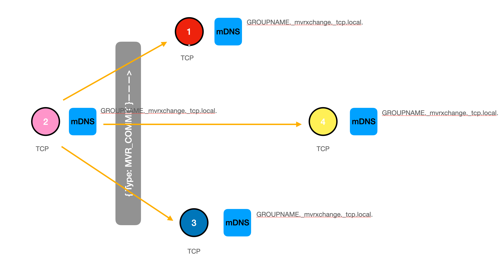
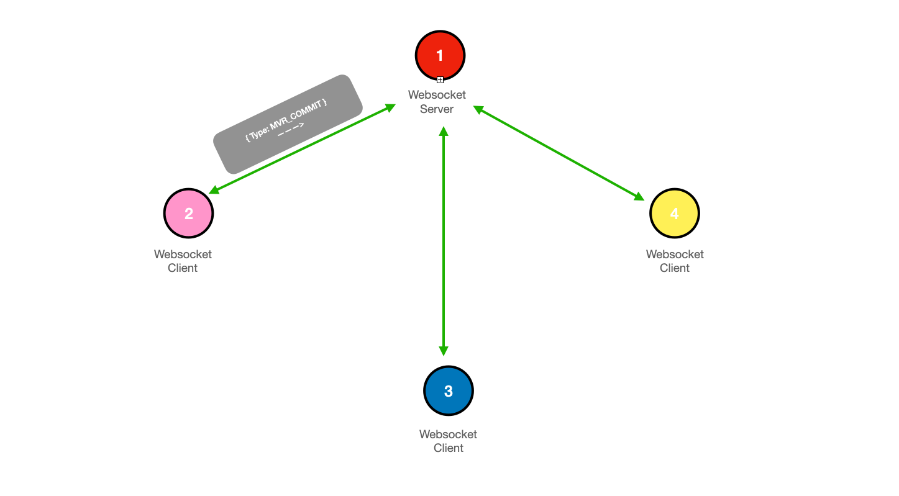
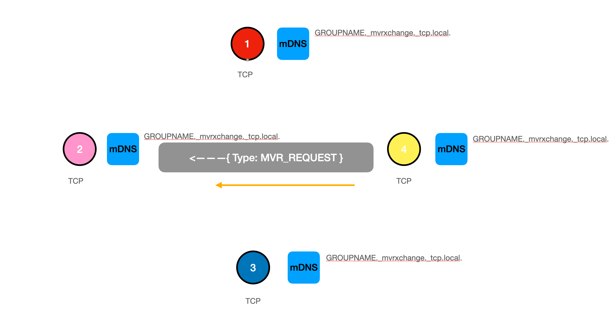

MVR Version 1.6 - DIN SPEC 15801

# Introduction

MVR - My Virtual Rig - specified in this DIN SPEC will unify the information exchange between different applications within the entertainment industry. Based on GDTF, as specified in DIN SPEC 15800, MVR allows the exchange of scenic and environmental information and complete show setups as planning status. Furthermore the MVR file format allows programs to share data and geometry for a scene. A scene is a set of parametric objects such as fixtures, trusses, video screens, and other objects that are used secifically in the entertainment industry.

Typical workflow
1.  Program A saves an MVR file containing a scene;
2.  Program B imports this file;
3.  Program B changes some parametric data in the scene;
4.  Program B saves an MVR containing the scene;
5.  Program A imports this file and applies the changes to the existing objects.


# Scope

This document specifies "My Virtual Rig" (MVR), which is designed to provide a unified way of listing and describing the hierarchical and logical structure based on DIN SPEC 15800 "General Device Type Format" (GDTF) - and further environmental information of a show setup in the entertainment business. It will be used as a foundation for the exchange of extended device and environmental data between lighting consoles, CAD and 3D-pre-visualization applications. The purpose of an MVR-file is to reflect the real-world physical components of a show setup and the logical patch information of the devices while maintaining the kinematic chain.


# Normative references

The following documents are referred to in the text in such a way that some or all of their content constitutes
requirements of this document. For dated references, only the edition cited applies. For undated references,
the latest edition of the referenced document (including any amendments) applies.

- [DIN SPEC 15800:2022-02, Entertainment Technology— General Device Type Format (GDTF)](https://www.beuth.de/en/technical-rule/din-spec-15800/349717520)
- [ISO/IEC 21778:2017, Information technology— The JSON data interchange syntax](https://standards.iso.org/ittf/PubliclyAvailableStandards/c071616_ISO_IEC_21778_2017.zip)
- [Extensible Markup Language (XML) 1.0](https://www.w3.org/TR/2008/REC-xml-20081126/)
- [PKWARE 6.3.3](https://pkware.cachefly.net/webdocs/casestudies/APPNOTE.TXT)
- [Domain Names— Implementation and Specification](https://www.ietf.org/rfc/rfc1035.txt)
- [RFC3629, UTF-8, a transformation format of ISO 10646](https://datatracker.ietf.org/doc/html/rfc3629)
- [RFC4122, A Universally Unique IDentifier (UUID) URN Namespace](https://www.rfc-editor.org/rfc/rfc4122)
- [RFC6455, The WebSocket Protocol](https://www.ietf.org/rfc/rfc6455.txt)
- [RFC6762, Multicast DNS](https://www.ietf.org/rfc/rfc6762.txt)
- [RFC6763, DNS-Based Service Discovery](https://www.ietf.org/rfc/rfc6763.txt)


# Terms and definitions

For the purposes of this document, the following terms and definitions apply.
DIN and DKE maintain terminological databases for use in standardization at the following addresses:

  - DIN-TERMinologieportal: available at
    <https://www.din.de/go/din-term>
  - DKE-IEV: available at <http://www.dke.de/DKE-IEV>


### My Virtual Rig, MVR
descriptive name of the specification

### MVR-xchange
protocol to share MVR files over the network

### MVR-xchange client
application that participates in the MVR-xchange

### MVR-xchange group
group of MVR-xchange clients that work on the same project and communicate together

### TCP Mode
MVR-xchange communication via TCP packages and discovery via mDNS

### WebSocket Mode
MVR-xchange communication via WebSockets and discovery via DNS


# MVR Definitions

## General

MVR consists of two parts to enable any application to exchange GDTF but also general information in the same
common format. Firstly the MVR file format as described in the following section. Secondly a MVR communication format to simplify exchange between applications.


## File Format Definition

To describe all information within one file, a zip file according to PKWARE 6.3.3 with the extension `*.mvr` is used. The archive shall contain one root file named `GeneralSceneDescription.xml`, along with all other resource files referenced via this Root File. The root file `GeneralSceneDescription.xml` is mandatory inside the archive to be a valid MVR file.

UTF-8 according to RFC3629 has to be used to encode the XML file. Each XML file internally consists of XML nodes. Each XML node could have XML attributes and XML node children. Each XML attribute has a value. If a XML attribute is not specified, the default value of this XML attribute will be used. If the XML attribute value is
specified as a string, the format of the string will depend on the XML attribute type.

- The archive shall not use encryption or password protection.
- All files referenced by the Root File shall be placed at the root level. They shall not be placed in folders.
- Files shall be placed using either STORE (uncompressed) or DEFLATE compression. No other compression algorithms are supported.
- Files may be placed into the archive in any order.
- A `Universal.gdtt` GDTF template file with a `.gdtt` extension can be added to define Gobos, Emitters, Filter and such for referencing.
- Filenames within the archive must not differ only by case. Eg it is prohibited to have the files `GEO1.glb` and `geo1.glb` within the same archive.
- The file name of the ZIP archive can be chosen freely.

All objects used have a persistent unique ID to track changes between the different applications. If there are no changes to the original GDTF file it is mandatory to keep it in the MVR during export. If there are changes to the GDTF file it is mandatory to add a revision to the GDTF file in order to reflect it.

Only user-intended modifications of any part of the MVR file shall be processed. This is particular important if applications in the workflow do not need or accept all data of the MVR file. Such behaviour guarantees that all later steps in the workflow have access to the original intended data.

- EXAMPLE An example of a typical MVR archive is shown below:

```
GeneralSceneDescription.xml
Custom@Fixture1.gdtf
Custom@Fixture2.gdtf
geo1.3ds
geo1.glb
Textr12.png
Universal.gdtt
```


## Generic Value Types

Table 1 contains a list of the available types for node or attribute values:

##### Table 1 — *XML Generic Value Types*

| Value Type Name    | Description                                      |
| ------------------ |--------------------------------------------------------------------------- |
| <span id="user-content-attrtype-integer"> Integer </span>  | A signed or unsigned integer value represented in base 10. Uses a dash ‘-’ (U+002D)
as a prefix to denote negative numbers. E.g. `15` or `-6`|
| <span id="user-content-attrtype-float"> Float </span>      | A floating point numeric value represented in #attrType-Bool base 10 decimal or scientific format.<br/>Uses full stop '.' (U+002E) to delimit the whole and decimal part and 'e' or 'E' to delimit mantissa and exponent.<br/>Implementations shall write sufficient decimal places to precisely round-trip their internal level of precision.<br/>Infinities and not-a-number (NaN) are not permitted.<br/>Eg `1.5`, `3.9265e+2`|
| <span id="user-content-attrtype-bool"> Bool </span>        | A boolean value. When representing `true` inidcate with true, when `false` indicate with false. | 
| <span id="user-content-attrtype-string"> String </span>    | Any sequence of Unicode codepoints, encoded as necessary for XML.<br>Eg The following XML encodings (with their meaning in brackets):<br/>`&lt;` (\<), `&amp;` (&), `&gt;` (\>), `&quot;` ("), and `&apos;` (') |
| <span id="user-content-attrtype-enum"> Enum </span>        | Possible values are predefined |  
| <span id="user-content-attrtype-uuid"> UUID </span>        | A UUID to RFC4122 in text representation.<br/>The nil UUID (all zeros) is not permitted.<br/>Formatted as `XXXXXXXX-XXXX-XXXX-XXXX-XXXXXXXXXXXX`.<br/> Used to link objects. |
| <span id="user-content-attrtype-vector">Vector</span>      | Three Float values separated by ',' defining a 3D vector's X, Y, and Z components.<br/>Eg `1.0,2.0,3.0`|
| <span id="user-content-attrtype-filename">FileName</span>  | The case-sensitive name of a file within the archive including the extension.<br/>The filename must not contain any FAT32 or NTFS reserved characters.<br/>The extension is delimited from the base name by full stop '.' and the base name shall not be empty.<br/>It is recommended to limit filenames to the POSIX "Fully Portable Filenames" character set: [A-Z], [a-z], [0-9], the symbols '\_' (U+005F), '-' (U+002D) and a maximum of one '.' (U+002E)<br/>Eg `My-Fixture_5.gdtf`|
| <span id="user-content-attrtype-ciecolor">CIE Color</span> | CIE 1931 xyY absolute color point.<br/>Formatted as three Floats `x,y,Y`<br/>Eg `0.314303,0.328065,87.699166`|
| <span id="user-content-attrtype-ipv4">IPv4 Address</span>  | Common IPv4 Address in the format of dotted decimal notation.<br/>Eg `192.168.1.10` |
| <span id="user-content-attrtype-ipv6">IPv6 Address</span>  | Common IPv6 Address in the format of hexadecimal notation.<br/>Eg `2001:0db8:85a3:0000:0000:8a2e:0370:7344` |


## Node Definiftions

The first XML node is always the XML description node: `<?xml version="1.0" encoding="UTF-8"?>` 

## GeneralSceneDescription Node 

The second XML node is the mandatory GeneralSceneDescription node. The attributes of this node are listed in Table 2, the children of this node are given in Table 3. 

##### Table 2 — *GeneralSceneDescription Node Attributes*

| Attribute Name | Attribute Value Type                      | Default Value when Optional | Description                                  |
| -------------- | ----------------------------------------- | --------------------------- | ------------------------------------------------------------------- |
| verMajor       | [Integer](#user-content-attrtype-integer) | Not Optional                | Denotes the major version of the format used when saving this file. |
| verMinor       | [Integer](#user-content-attrtype-integer) | Not Optional                | Denotes the minor version of the format used when saving this file. |
| provider       | [String](#user-content-attrtype-string)   | Not Optional                | The name of the application that is generating the MVR export. This should stay the same between multiple version.     |
| providerVersion| [String](#user-content-attrtype-string)   | Not Optional                | The version of the software that is generating the MVR export. This should be different for each version that is available.    |

The current version of MVR reflected by this document is 1.6.


##### Table 3 — *GeneralSceneDescription Node Children*

| Child Node | Allowed Count | Description                                    |
| ---------- | ------------- | ---------------------------------------------- |
| UserData   | 0 or 1        | Specifies user data associated with this file. |
| Scene      | 1             | Defines the scene described in this file.      |

## Node Definition: UserData

### General

This node contains a collection of user data nodes defined and used by provider applications if required. User data should not be expected to be preserved in the workflow of multiple applications importing and exporting the data. The defined UserData Node Children are specified in Table 4.

Node name: `UserData`

##### Table 4 — *UserData Node Children*

| Child Node                    | Allowed Count | Description                   |
| ----------------------------- | ------------- | ----------------------------- |
| [Data](#node-definition-data) | 0 or many     | Defines a block of user data. |


### Node Definition: Data

This node contains a collection of data specified by the provider application. The defined Data Node Attributes are specified in Table 5.

Node name: `Data`

##### Table 5 — *Data Node Attributes*

| Attribute Name | Attribute Value Type                    | Default Value when Optional | Description                                                               |
| -------------- | --------------------------------------- | --------------------------- | ------------------------------------------------------------------------- |
| provider       | [String](#user-content-attrtype-string) | Not Optional                | Specifies the name of the provider application that created this data.    |
| ver            | [String](#user-content-attrtype-string) | 1                           | Version information of the data as specified by the provider application. |


## Node Definition: Scene

This node contains information about the scene. The defined Scene Node Children are specified in Table 6.

Node name: `Scene`

##### Table 6 — *Scene Node Children*

| Child Node                          | Allowed Count | Description                           |
| ----------------------------------- | ------------- | ------------------------------------- |
| [AUXData](#node-definition-auxdata) | 0 or 1        | Defines auxiliary data for the scene. |
| [Layers](#node-definition-layers)   | 1             | A list of layers in the scene.        |


## Node Definition: AUXData

### General

This node contains auxiliary data for the scene node. The defined AUXData Node Children are specified in Table 7.

Node name: `AUXData`

##### Table 7 — *AUXData Node Children*

| Child Node                                              | Allowed Count | Description                                                    |
| ------------------------------------------------------- | ------------- | ---------------------------------------------------------------|
| [Symdef](#node-definition-symdef)                       | 0 or any      | Graphical representation that will be instanced in the scene.  |
| [Position](#node-definition-position)                   | 0 or any      | Defines a logical group of lighting devices.                   |
| [MappingDefinition](#node-definition-mappingdefinition) | 0 or any      | Defines a input source for fixture color mapping applications. |
| [Class](#node-definition-class)                         | 0 or any      | Defines a Class for object visiblity filtering.                |


### Node Definition: Symdef

This node contains the graphics so the scene can refer to this, thus optimizing repetition of the geometry. The child objects are located within a local coordinate system. The defined Symdef Node Attributes are specified in Table 8.

Node name: `Symdef`

##### Table 8 — *Symdef Node Attributes*

| Attribute Name | Attribute Value Type                    | Default Value when Optional | Description                          |
| -------------- | --------------------------------------- | --------------------------- | ------------------------------------ |
| uuid           | [UUID](#user-content-attrtype-uuid)     | Not Optional                | The unique identifier of the object. |
| name           | [String](#user-content-attrtype-string) | Empty                       | The name of the object               |


The Symdef node (Table 9) contains the following children.

##### Table 9 — *Symdef Node Children*

| Child Node                                        | Allowed Count | Value Type                                | Description                                         |
| ------------------------------------------------- | ------------- | ----------------------------------------- | --------------------------------------------------- |
| ChildList                                        | 1             | [Integer](#user-content-attrtype-integer) | The size in x direction in pixels of the source.    |

The child list (Table 10) contains a list of the following nodes:

##### Table 10 — *Symdef Childlist Node Children*

| Child Node                                | Description                                                          |
| ----------------------------------------- | -------------------------------------------------------------------- |
| [Geometry3D](#node-definition-geometry3d) | The geometry of this definition that will be instanced in the scene. |
| [Symbol](#node-definition-symbol)         | The symbol instance that will provide a geometry of this definition. |


### Node Definition: Position

This node defines a logical grouping of lighting devices and trusses. The defined Position Node Attributes are specified in Table 11.

Node name: `Position`

##### Table 11 — *Position Node Attributes*

| Attribute Name | Attribute Value Type                    | Default Value when Optional | Description                          |
| -------------- | --------------------------------------- | --------------------------- | ------------------------------------ |
| uuid           | [UUID](#user-content-attrtype-uuid)     | Not Optional                | The unique identifier of the object. |
| name           | [String](#user-content-attrtype-string) | Empty                       | The name of the object               |


### Node Definition: MappingDefinition

This node specifies an input source for fixture color mapping applications. The defined MappingDefinition Node Attributes are specified in Table 12.

Node name: `MappingDefinition`

##### Table 12 — *MappingDefinition Node Attributes*

| Attribute Name | Attribute Value Type                | Default Value when Optional | Description                             |
| -------------- | ----------------------------------- | --------------------------- | --------------------------------------- |
| uuid           | [UUID](#user-content-attrtype-uuid) | Not Optional                | The unique identifier of the object.    |
| name           | [String](#user-content-attrtype-string)              |                             | The name of the source for the mapping. |

The child list (Table 13) contains a list of the following nodes:

##### Table 13 — *MappingDefinition Node Children*

| Child Node                                        | Allowed Count | Value Type                                | Description                                         |
| ------------------------------------------------- | ------------- | ----------------------------------------- | --------------------------------------------------- |
| SizeX                                             | 1             | [Integer](#user-content-attrtype-integer) | The size in x direction in pixels of the source.    |
| SizeY                                             | 1             | [Integer](#user-content-attrtype-integer) | The size in y direction in pixels of the source.    |
| [Source](#node-definition-source)                 | 1             |                                           | The video source that will be used for the Mapping. |
| [ScaleHandeling](#node-definition-scalehandeling) | 0 or 1        |                                           | How the source will be scaled to the mapping.       |

```xml
<MappingDefinition name="MappingStyle for View 1" uuid="BEF95EB8-98AC-4217-B10D-FB4B83381398">
    <SizeX>1920</SizeX>
    <SizeY>1080</SizeY>
   movie.mov
    
    <ScaleHandeling>UpScale</ScaleHandeling>
</MappingDefinition>
```

### Node Definition: Class

This node defines a logical grouping across different layers. Primarily used for controlling object visibility of objects across multiple Layers. The defined Class Node Attributes are specified in Table 14.

Node name: `Class`

##### Table 14 — *Class Node Attributes*

| Attribute Name | Attribute Value Type                | Default Value when Optional | Description                         |
| -------------- | ----------------------------------- | --------------------------- | ----------------------------------- |
| uuid           | [UUID](#user-content-attrtype-uuid) | Not Optional                | The unique identifier of the class. |
| name           | [String](#user-content-attrtype-string)              |                             | The name of the Class.              |


### Node Definition: Layers

This node defines a list of layers inside the scene. The layer is a container of graphical objects defining a local coordinate system.

Node name: `Layers`

The child list (Table 15) contains a list of layer nodes:

##### Table 15 — *Layers Node Childs*

| Child Node                      | Description             |
| ------------------------------- | ----------------------- |
| [Layer](#node-definition-layer) | A layer representation. |


#### Node Definition: Layer

This node defines a layer. The layer is a spatial representation of a geometric container. The child objects are located inside a local coordinate system. The defined Layer Node Attributes are specified in Table 16.

Node name: `Layer`

##### Table 16 — *Layer Node Attributes*

| Attribute Name | Attribute Value Type                    | Default Value when Optional | Description                          |
| -------------- | --------------------------------------- | --------------------------- | ------------------------------------ |
| uuid           | [UUID](#user-content-attrtype-uuid)     | Not Optional                | The unique identifier of the object. |
| name           | [String](#user-content-attrtype-string) | Empty                       | The name of the object               |

The child list (Table 17) contains a list of layer nodes:

##### Table 17 — *Layer Node Childs*

| Child Node                              | Allowed Count | Description                                                          |
| --------------------------------------- | ------------- | -------------------------------------------------------------------- |
| [Matrix](#node-definition-matrix)       | 0 or 1        | The transformation matrix that defines the location and orientation of this the layer inside its global coordinate space. This effectively defines local coordinate space for the objects inside. The Matrix of the Layer is only allowed to have a vertical Transform (elevation). Rotation and scale must be identity. Rotation and scale must be identity, means no rotation and no scale. |
| [ChildList](#node-definition-childlist) | 0 or 1            | A list of graphic objects that are part of the layer.           |


## Node Definition: ChildList

This node defines a list of graphical objects.

Node name: `ChildList`

The child list (Table 18) contains a list of the following nodes:

##### Table 18 — *ChildList Node Childs*

| Child Node                                  | Description                                                                  |
| ------------------------------------------- | ---------------------------------------------------------------------------- |
| [SceneObject](#node-definition-sceneobject) | A generic graphical object from the scene.                                   |
| [GroupObject](#node-definition-groupobject) | A grouping object of other graphical objects inside local coordinate system. |
| [FocusPoint](#node-definition-focuspoint)   | A definition of a focus point.                                               |
| [Fixture](#node-definition-fixture)         | A definition of a fixture.                                                   |
| [Support](#node-definition-support)         | A definition of a support.                                                   |
| [Truss](#node-definition-truss)             | A definition of a truss.                                                     |
| [VideoScreen](#node-definition-videoscreen) | A definition of a video screen.                                              |
| [Projector](#node-definition-projector)     | A definition of a projector.                                                 |


## Node Definition for Parametric Objects

### Node Definition: SceneObject

This node defines a generic graphical object. The defined SceneObject Node Attributes are specified in Table 19.

Node name: `SceneObject`

##### Table 19 — *SceneObject Node Attributes*

| Attribute Name | Attribute Value Type                    | Default Value when Optional | Description                          |
| -------------- | -------------------------------------   | --------------------------- | ------------------------------------ |
| uuid           | [UUID](#user-content-attrtype-uuid)     | Not Optional                | The unique identifier of the object. |
| name           | [String](#user-content-attrtype-string) | Empty                       | The name of the object               |
| multipatch     | [UUID](#user-content-attrtype-uuid)     | Empty                       | The unique identifier of the parent multipatch fixture. When this value is set, you may not define a FixtureID or CustomID for this fixture. The FixtureID and CustomID from the object defined as multi parent also applies to this object.   |

The child list (Table 20) contains a list of one of the following nodes:

##### Table 20 — *SceneObject Node Childs*

| Child Node                                        | Allowed Count | Value Type                                  | Description                                     |
| ------------------------------------------------- | ------------- | ------------------------------------------- | ----------------------------------------------- |
| [Matrix](#node-definition-matrix)                 | 0 or 1        |                                             | The location and orientation of the object inside the parent coordinate system. |
| [Classing](#node-definition-class)             | 0 or 1        | [UUID](#user-content-attrtype-uuid)         | The Class the object belongs to.                |
| [Geometries](#node-definition-geometries)         | 1             |                                             | A list of geometrical representation objects that are part of the object.       |
| GDTFSpec                                          | 0 or 1        | [FileName](#user-content-attrtype-filename) | The name of the file containing the GDTF information for this object, conforming to the DIN SPEC 15800. |
| GDTFMode                                          | 0 or 1        | [String](#user-content-attrtype-string)     | The name of the used DMX mode. This has to match the name of a DMXMode in the GDTF file. Mandatory when `GDTFSpec` as been defined.                                                      |
| CastShadow                                        | 0 or 1        | [Bool](#user-content-attrtype-bool)         | Defines if an object cast shadows.              |
| [Addresses](#node-definition-addresses)           | 0 or 1        |                                             | The container for DMX Addresses for this object.|
| [Alignments](#node-definition-alignments)         | 0 or 1        |                                             | The container for Alignments for this object.   |
| [CustomCommands](#node-definition-customcommands) | 0 or 1        |                                             | The container for custom command for this object.|
| [Overwrites](#node-definition-overwrites)         | 0 or 1        |                                             | The container for overwrites for this object.   |
| [Connections](#node-definition-connections)       | 0 or 1        |                                             | The container for connections for this object.  |
| FixtureID                               | 1             | [String](#user-content-attrtype-string)      | The Fixture ID is an identifier for the instance of this fixture that can be used to activate / select them for programming. |
| FixtureIDNumeric                        | 1             | [Integer](#user-content-attrtype-integer)    | The Fixture ID is an identifier for the instance of this fixture that can be used to activate / select them for programming. |
| UnitNumber                                        | 0 or 1        | [Integer](#user-content-attrtype-integer)   | The identification of a fixture on its position. </b> Use this as an alternative numbering scheme if the planning and programming numbering is different.  |
| CustomId                                          | 0 or 1        | [Integer](#user-content-attrtype-integer)   | The Custom ID is a value that can be used as a short name of the Fixture Instance. This does not have to be unique. The default value is 0.   |
| CustomIdType                            | 0 or 1        | [Integer](#user-content-attrtype-integer)    | Defines the CustomID Type this object belongs to.    |
| [ChildList](#node-definition-childlist) | 0 or 1             | A list of graphic objects that are part of the layer.   |


### Node Definition: GroupObject

This node defines logical group of objects. The child objects are located inside a local coordinate system. The defined GroupObject Node Attributes are specified in Table 21.

Node name: `GroupObject`

##### Table 21 — *GroupObject Node Attributes*

| Attribute Name | Attribute Value Type                    | Default Value when Optional | Description                          |
| -------------- | --------------------------------------- | --------------------------- | ------------------------------------ |
| uuid           | [UUID](#user-content-attrtype-uuid)     | Not Optional                | The unique identifier of the object. |
| name           | [String](#user-content-attrtype-string) | Empty                       | The name of the object               |

The child list (Table 22) contains a list of one of the following nodes:

##### Table 22 — *GroupObject Node Childs*

| Child Node                              | Allowed Count | Value Type                          | Description                                                                     |
| --------------------------------------- | ------------- | ----------------------------------- | ------------------------------------------------------------------------------- |
| [Matrix](#node-definition-matrix)       | 0 or 1        |                                     | The location and orientation of the object inside the parent coordinate system. |
| [Classing](#node-definition-class)   | 0 or 1        | [UUID](#user-content-attrtype-uuid) | The Class the object belongs to.                                                |
| [ChildList](#node-definition-childlist) | 0 or 1             |                                     | A list of graphic objects that are part of the group.                           |


### Node Definition: FocusPoint

This node defines a focus point object. The defined FocusPoint Node Attributes are specified in Table 23.

Node name: `FocusPoint`

##### Table 23 — *FocusPoint Node Attributes*

| Attribute Name | Attribute Value Type                    | Default Value when Optional | Description                          |
| -------------- | --------------------------------------- | --------------------------- | ------------------------------------ |
| uuid           | [UUID](#user-content-attrtype-uuid)     | Not Optional                | The unique identifier of the object. |
| name           | [String](#user-content-attrtype-string) | Empty                       | The name of the object               |

The child list (Table 24) contains a list of one of the following nodes:

##### Table 24 — *FocusPoint Node Childs*

| Child Node                                | Allowed Count | Value Type                          | Description                                                                     |
| ----------------------------------------- | ------------- | ----------------------------------- | ------------------------------------------------------------------------------- |
| [Matrix](#node-definition-matrix)         | 0 or 1        |                                     | The location and orientation of the object inside the parent coordinate system. |
| [Classing](#node-definition-class)     | 0 or 1        | [UUID](#user-content-attrtype-uuid) | The Class the object belongs to.                                                |
| [Geometries](#node-definition-geometries) | 1             |                                     | A list of geometrical representation objects that are part of the object.       |


### Node Definition: Fixture

This node defines an entertainment fixture object. The defined FixtureNode Attributes are specified in Table 25.

Node name: `Fixture`

##### Table 25 — *Fixture Node Attributes*

| Attribute Name | Attribute Value Type                    | Default Value when Optional | Description                          |
| -------------- | --------------------------------------- | --------------------------- | ------------------------------------ |
| uuid           | [UUID](#user-content-attrtype-uuid)     | Not Optional                | The unique identifier of the object. |
| name           | [String](#user-content-attrtype-string) | Empty                       | The Name is the value that represents the fixture object. Is is not unique, and normally pairs with  FID in Display               |
| multipatch     | [UUID](#user-content-attrtype-uuid)     | Empty                       | The unique identifier of the parent multipatch fixture. When this value is set, you may not define a FixtureID or CustomID for this fixture. The FixtureID and CustomID from the object defined as multi parent also applies to this object.              |

The child list (Table 26) contains a list of one of the following nodes:

##### Table 26 — *Fixture Node Childs*

| Child Node                              | Allowed Count | Value Type                                   | Description                                                                                                                                   |
| --------------------------------------- | ------------- | -------------------------------------------- | --------------------------------------------------------------------------------------------------------------------------------------------- |
| [Matrix](#node-definition-matrix)       | 0 or 1        |                                              | The location of the object inside the parent coordinate system. |
| [Classing](#node-definition-class)   | 0 or 1        | [UUID](#user-content-attrtype-uuid)          | The Class the object belongs to.                                |
| GDTFSpec                                | 0 or 1        | [FileName](#user-content-attrtype-filename)  | The name of the file containing the GDTF information for this object, conforming to the DIN SPEC 15800. |
| GDTFMode                                | 0 or 1        | [String](#user-content-attrtype-string)      | The name of the used DMX mode. This has to match the name of a DMXMode in the GDTF file. Mandatory when `GDTFSpec` as been defined.                                                     |
| Focus                                   | 0 or 1        | [UUID](#user-content-attrtype-uuid)          | A focus point reference that this lighting fixture aims at if this reference exists.                                                          |
| CastShadow                              | 0 or 1        | [Bool](#user-content-attrtype-bool)                       | Defines if a Object cast Shadows.                                                                                                             |
| DMXInvertPan                            | 0 or 1        | [Bool](#user-content-attrtype-bool)                       | Defines of all Pan Channels of the fixture should be DMX Inverted.                                                                                                             |
| DMXInvertTilt                           | 0 or 1        | [Bool](#user-content-attrtype-bool)                       | Defines of all Tilt Channels of the fixture should be DMX Inverted.                                                                                                             |
| Position                                | 0 or 1        | [UUID](#user-content-attrtype-uuid)          | A position reference that this lighting fixture belongs to if this reference exists.                                                          |
| Function                                | 0 or 1        | [String](#user-content-attrtype-string)      | The name of the purpose this Fixture has.                                                       |
| FixtureID                               | 1             | [String](#user-content-attrtype-string)      | The Fixture ID is an identifier for the instance of this fixture that can be used to activate / select them for programming.                  |
| FixtureIDNumeric                        | 1             | [Integer](#user-content-attrtype-integer)    | The Fixture ID is an identifier for the instance of this fixture that can be used to activate / select them for programming.                |
| UnitNumber                              | 1             | [Integer](#user-content-attrtype-integer)    | The identification of a fixture on its position. </b> Use this as an alternative numbering scheme if the planning and programming numbering is different. |
| ChildPosition                           | 0 or 1        | [String](#user-content-attrtype-string)        | Node link to the geometry. Starting point is the Geometry Collect of the linked parent GDTF of this object.                                   |
| [Addresses](#node-definition-addresses) | 0 or 1        |                                              | The container for DMX Addresses for this fixture.                                                                                             |
| [Protocols](#node-definition-protocols) | 0 or 1        |                                              | The container for protocols assignments.                                                                                                      |
| [Alignments](#node-definition-alignments) | 0 or 1      |                                              | The container for Alignments for this fixture.                                                                                              |
| [CustomCommands](#node-definition-customcommands) | 0 or 1 |                                           | The container for custom command for this fixture.                                                                                  |
| [Overwrites](#node-definition-overwrites) | 0 or 1      |                                              | The container for overwrites for this fixture.                                                                                              |
| [Connections](#node-definition-connections) | 0 or 1    |                                              | The container for connections for this fixture.                                                                                            |
| Color                                | 0 or 1        | [CIE Color](#user-content-attrtype-ciecolor) | A color assigned to a fixture. If it is not defined, there is no color for the fixture.                                                       |
| CustomIdType                            | 0 or 1        | [Integer](#user-content-attrtype-integer)    | Defines the CustomID Type this fixture belongs to. A Custom ID Type defines to which group of objects this objects belongs as an additional object identifier.  The types for the custom ID Types are defined below. |
| CustomId                                | 0 or 1        | [Integer](#user-content-attrtype-integer)    | The CustomId ID is an identifier for the instance of this fixture within the Custom ID Type that can be used to activate / select them for programming.   |
| [Mappings](#node-definition-mappings)   | 0 or 1        |                                              | The container for Mappings for this fixture.                                                                                                  |
| [Gobo](#node-definition-gobo)           | 0 or 1        |                                              | The Gobo used for the fixture. The image resource must conform to the GDTF standard.                                 |
| [ChildList](#node-definition-childlist) | 0 or 1             |   | A list of graphic objects that are part of the layer.                                                                                                                                    |

Note: _The fixture has no `Geometries` node as geometry is defined in a GDTF file._

CustomID Types
- 0 Undefined
- 1 Fixture
- 2 Channel
- 4 Houselights
- 5 NonDim
- 6 Media
- 7 Fog
- 8 Effect
- 9 Pyro
- 10 Marker

For further information about the difference between FixtureID and CustomID refer to Annex A.

EXAMPLE An example of a node definition is shown below:


```xml
<Fixture name="Robe Robin MMX WashBeam" uuid="8BF13DD7-CBF4-415B-99E4-625FE4D2DAF6">
    <Matrix>{0.158127,-0.987419,0.000000}{0.987419,0.158127,0.000000}{0.000000,0.000000,1.000000}{6020.939200,2838.588955,4978.134459}</Matrix>
    <GDTFSpec>Custom@Robe Robin MMX WashBeam</GDTFSpec>
    <GDTFMode>DMX Mode</GDTFMode>
    <Focus>4A B1 94 62 A6 E3 4C 3B B2 5A D8 09 9F 78 17 0C</Focus>
    <Position>77 BC DE 16 95 A6 47 25 9D 04 16 A0 BD 67 CD 1A</Position>
    <Addresses>
        <Address break="0">45</Address>
        <Network Interface="ethernet_1" IPv4="192.168.11.5" SubnetMask="255.255.0.0" />
        <Network Interface="ethernet_2" IPv6="2001:0db8:85a3:0000:0000:8a2e:0370:7344" />
        <Network Interface="wireless_1" DHCP="on" />
    </Addresses>
    <Protocols>
        <Protocol geometry="NetworkInOut_1" type="Art-Net" />
        <Protocol geometry="NetworkInOut_3" name="NDI 1" type="NDI"/>
    </Protocols>
    <Alignments>
        <Alignment geometry="Beam" up="0,0,1" direction="0,0,-1"/>
    </Alignments>
     <CustomCommands>
        <CustomCommand>Body_Pan,f 50</CustomCommand>
        <CustomCommand>Yoke_Tilt,f 50</CustomCommand>
    </CustomCommands>
    <Overwrites>
            <Overwrite universal="Universal Wheel 1.Universal Wheel Slot 1" target="Wheel 1.Wheel Slot"/>
            <Overwrite universal="Universal Emitter 1" target="Emitter 1" />
            <Overwrite universal="Universal Filter 1" target="Filter 1" />
            <Overwrite universal="Universal Wheel 1.Universal Wheel Slot 2"/>
    </Overwrites>
    <Mappings>
        <Mapping linkedDef="BEF95EB8-98AC-4217-B10D-FB4B83381398">
            <ux>10</ux>
            <uy>10</uy>
            <ox>5</ox>
            <oy>5</oy>
            <rz>45</rz>
        </Mapping>
    </Mappings>
    <Connections>    
      <Connection own="Input" toObject="8BF13DD7-CBF4-415B-99E4-625FE4D2DAF6" other="Output1"/>
      <Connection own="1" toObject="8BF13DD7-CBF4-415B-99E4-625FE4D2DAF6" other="IN"/>
      <Connection own="2" toObject="8BF13DD7-CBF4-415B-99E4-625FE4D2DAF6" other="IN"/>
    </Connections>
    <FixtureID></FixtureID>
    <UnitNumber>0</UnitNumber>
    <Function>Speaker 1</Function>
    <CustomId>0</CustomId>
    <CustomIdType>0</CustomIdType>
    <DMXInvertPan>true</DMXInvertPan>
    <DMXInvertTilt>true</DMXInvertTilt>
    <Color>2.533316,-5.175210,3.699302</Color>
    <Gobo rotation="32.5">image_file_forgobo</Gobo>
    <ChildList>
      <Fixture name="Fancy Attachment to the Beam" uuid="8BF13DD7-CBF4-415B-99E4-625FE4D2DAF5">
        <GDTFSpec>Fancy@Attachment</GDTFSpec>
        <GDTFMode>DMX Mode</GDTFMode>
        <!-->The parent GDTF here is the one from the Robe Robin MMX WashBeam</!-->
        <ChildPosition>Base.Yoke.Head</ChildPosition>
        <!-->The position is now defined based on the ECS from the geometry of parents GDTF including all applied Rotation via DMX or other protocols</!-->
        <Matrix>{0.158127,-0.987419,0.000000}{0.987419,0.158127,0.000000}{0.000000,0.000000,1.000000}{6020.939200,2838.588955,4978.134459}</Matrix>
      </Fixture>
    </ChildList>
</Fixture>
```


## Node Definition: Truss

This node defines a truss object. The defined Truss Node Attributes are specified in Table 27.

Node name: `Truss`

##### Table 27 — *Truss Node Attributes*

| Attribute Name | Attribute Value Type                    | Default Value when Optional | Description                          |
| -------------- | --------------------------------------- | --------------------------- | ------------------------------------ |
| uuid           | [UUID](#user-content-attrtype-uuid)     | Not Optional                | The unique identifier of the object. |
| name           | [String](#user-content-attrtype-string) | Empty                       | The name of the object               |
| multipatch     | [UUID](#user-content-attrtype-uuid)     | Empty                       | The unique identifier of the parent multipatch fixture. When this value is set, you may not define a FixtureID or CustomID for this fixture. The FixtureID and CustomID from the object defined as multi parent also applies to this object.              |

The child list (Table 28) contains a list of one of the following nodes:

##### Table 28 — *Truss Node Childs*

| Child Node                                        | Allowed Count | Value Type                                  | Description                                                                                                                                   |
| ------------------------------------------------- | ------------- | ------------------------------------------- | --------------------------------------------------------------------------------------------------------------------------------------------- |
| [Matrix](#node-definition-matrix)                 | 0 or 1        |                                             | The location of the object inside the parent coordinate system.                                                                               |
| [Classing](#node-definition-class)             | 0 or 1        | [UUID](#user-content-attrtype-uuid)         | The Class the object belongs to.                                                                                                              |
| [Position](#node-definition-position)             | 0 or 1        | [UUID](#user-content-attrtype-uuid)         | A position reference that this truss belongs to if this reference exists.                                                                     |
| [Geometries](#node-definition-geometries)         | 1             |                                             | A list of geometrical representation objects that are a part of the object.                                                                   |
| Function                                          | 0 or 1        | [String](#user-content-attrtype-string)     | The name of the function this Truss is used for.                                                                                              |
| GDTFSpec                                          | 0 or 1        | [FileName](#user-content-attrtype-filename) | The name of the file containing the GDTF information for this object, conforming to the DIN SPEC 15800.                                       |
| GDTFMode                                          | 0 or 1        | [String](#user-content-attrtype-string)     | The name of the used DMX mode. This has to match the name of a DMXMode in the GDTF file.  Mandatory when `GDTFSpec` as been defined.                                                     |
| CastShadow                              | 0 or 1        | [Bool](#user-content-attrtype-bool)                       | Defines if a Object cast Shadows.                                                                                                             |
| [Addresses](#node-definition-addresses)           | 0 or 1        |                                             | The container for DMX Addresses for this object.                                                                                              |
| [Alignments](#node-definition-alignments)         | 0 or 1        |                                             | The container for Alignments for this object.                                                                                                 |
| [CustomCommands](#node-definition-customcommands) | 0 or 1        |                                             | The container for custom command for this object.                                                                                             |
| [Overwrites](#node-definition-overwrites)         | 0 or 1        |                                             | The container for overwrites for this object.                                                                                                 |
| [Connections](#node-definition-connections)       | 0 or 1        |                                             | The container for connections for this object.                                                                                                |
| ChildPosition                           | 0 or 1        | [String](#user-content-attrtype-string)        | Node Link to the Geometry. Starting point is the Geometry Collect of the linked parent GDTF of this object.                                   |
| [ChildList](#node-definition-childlist) | 0 or 1             | A list of graphic objects that are part of the layer.                                                                                                                                                                                                                            |
| FixtureID                               | 1             | [String](#user-content-attrtype-string)      | The Fixture ID is an identifier for the instance of this fixture that can be used to activate / select them for programming.                  |
| FixtureIDNumeric                        | 1             | [Integer](#user-content-attrtype-integer)    | The Fixture ID is an identifier for the instance of this fixture that can be used to activate / select them for programming.                |
| UnitNumber                                        | 0 or 1        | [Integer](#user-content-attrtype-integer)   | The identification of a fixture on its position. </b> Use this as an alternative numbering scheme if the planning and programming numbering is different. |
| CustomIdType                            | 0 or 1        | [Integer](#user-content-attrtype-integer)    | Defines the CustomID Type this fixture belongs to. A Custom ID Type defines to which group of objects this objects belongs as an additional object identifier.  The types for the custom ID Types are defined below. |
| CustomId                                | 0 or 1        | [Integer](#user-content-attrtype-integer)    | The CustomId ID is an identifier for the instance of this fixture within the Custom ID Type that can be used to activate / select them for programming.   |


## Node Definition: Support

This node defines a support object. The defined Support Node Attributes are specified in Table 29.

Node name: `Support`

##### Table 29 — *Support Node Attributes*

| Attribute Name | Attribute Value Type                    | Default Value when Optional | Description                          |
| -------------- | --------------------------------------- | --------------------------- | ------------------------------------ |
| uuid           | [UUID](#user-content-attrtype-uuid)     | Not Optional                | The unique identifier of the object. |
| name           | [String](#user-content-attrtype-string) | Empty                       | The name of the object               |
| multipatch     | [UUID](#user-content-attrtype-uuid)     | Empty                       | The unique identifier of the parent multipatch fixture. When this value is set, you may not define a FixtureID or CustomID for this fixture. The FixtureID and CustomID from the object defined as multi parent also applies to this object.              |

The child list (Table 30) contains a list of one of the following nodes:

##### Table 30 — *Support Node Childs*

| Child Node                                        | Allowed Count | Value Type                                   | Description                                                                                                                                   |
| ------------------------------------------------- | ------------- | -------------------------------------------- | --------------------------------------------------------------------------------------------------------------------------------------------- |
| [Matrix](#node-definition-matrix)                 | 0 or 1        |                                              | The location of the object inside the parent coordinate system.                                                                               |
| [Classing](#node-definition-class)             | 0 or 1        | [UUID](#user-content-attrtype-uuid)          | The Class the object belongs to.                                                                                                              |
| [Position](#node-definition-position)             | 0 or 1        | [UUID](#user-content-attrtype-uuid)          | A position reference that this support belongs to if this reference exists.                                                                   |
| [Geometries](#node-definition-geometries)         | 1             |                                              | A list of geometrical representation objects that are a part of the object.                                                                   |
| Function                                          | 0 or 1        | [String](#user-content-attrtype-string)      | The name of the function this support is used for.                                                                                            |
| ChainLength                                       | 1             | [Float](#user-content-attrtype-float)          | The chain length that will be applied to the GDTF .                                                                                           |
| GDTFSpec                                          | 0 or 1        | [FileName](#user-content-attrtype-filename)  | The name of the file containing the GDTF information for this object, conforming to the DIN SPEC 15800.                                       |
| GDTFMode                                          | 0 or 1        | [String](#user-content-attrtype-string)      | The name of the used DMX mode. This has to match the name of a DMXMode in the GDTF file. Mandatory when `GDTFSpec` as been defined.                                                     |
| CastShadow                              | 0 or 1        | [Bool](#user-content-attrtype-bool)                       | Defines if a Object cast Shadows.                                                                                                             |
| [Addresses](#node-definition-addresses)           | 0 or 1        |                                              | The container for DMX Addresses for this object.                                                                                              |
| [Alignments](#node-definition-alignments)         | 0 or 1        |                                              | The container for Alignments for this object.                                                                                                 |
| [CustomCommands](#node-definition-customcommands) | 0 or 1        |                                              | The container for custom command for this object.                                                                                             |
| [Overwrites](#node-definition-overwrites)         | 0 or 1        |                                              | The container for overwrites for this object.                                                                                                 |
| [Connections](#node-definition-connections)       | 0 or 1        |                                              | The container for connections for this object.                                                                                                |
| FixtureID                               | 1             | [String](#user-content-attrtype-string)      | The Fixture ID is an identifier for the instance of this fixture that can be used to activate / select them for programming.                  |
| FixtureIDNumeric                        | 1             | [Integer](#user-content-attrtype-integer)    | The Fixture ID is an identifier for the instance of this fixture that can be used to activate / select them for programming.                |
| UnitNumber                                        | 0 or 1        | [Integer](#user-content-attrtype-integer)    | The identification of a fixture on its position. </b> Use this as an alternative numbering scheme if the planning and programming numbering is different. |
| CustomIdType                            | 0 or 1        | [Integer](#user-content-attrtype-integer)    | Defines the CustomID Type this fixture belongs to. A Custom ID Type defines to which group of objects this objects belongs as an additional object identifier.  The types for the custom ID Types are defined below. |
| CustomId                                | 0 or 1        | [Integer](#user-content-attrtype-integer)    | The CustomId ID is an identifier for the instance of this fixture within the Custom ID Type that can be used to activate / select them for programming.   |
| [ChildList](#node-definition-childlist) | 0 or 1             | A list of graphic objects that are part of the layer.                                                                                                                                                                                                                            |


## Node Definition: VideoScreen

This node defines a video screen object. The defined VideoScreen Node Attributes are specified in Table 31.

Node name: `VideoScreen`

##### Table 31 — *VideoScreen Node Attributes*

| Attribute Name | Attribute Value Type                    | Default Value when Optional | Description                          |
| -------------- | --------------------------------------- | --------------------------- | ------------------------------------ |
| uuid           | [UUID](#user-content-attrtype-uuid)     | <Not Optional>              | The unique identifier of the object. |
| name           | [String](#user-content-attrtype-string) | Empty                       | The name of the object.              |
| multipatch     | [UUID](#user-content-attrtype-uuid)     | Empty                       | The unique identifier of the parent multipatch fixture. When this value is set, you may not define a FixtureID or CustomID for this fixture. The FixtureID and CustomID from the object defined as multi parent also applies to this object.              |

The child list (Table 32) contains a list of one of the following nodes:

##### Table 32 — *VideoScreen Node Childs*

| Child Node                                        | Allowed Count | Value Type                                   | Description                                                                                                                                   |
| ------------------------------------------------- | ------------- | -------------------------------------------- | --------------------------------------------------------------------------------------------------------------------------------------------- |
| [Matrix](#node-definition-matrix)                 | 0 or 1        |                                              | The location of the object inside the parent coordinate system.                                                                               |
| [Classing](#node-definition-class)             | 0 or 1        | [UUID](#user-content-attrtype-uuid)          | The Class the object belongs to.                                                                                                              |
| [Geometries](#node-definition-geometries)         | 1             |                                              | A list of geometrical representation objects that are a part of the object.                                                                   |
| [Sources](#node-definition-sources)               | 0 or 1        |                                              | A list of video input sources..                                                                                                               |
| Function                                          | 0 or 1        | [String](#user-content-attrtype-string)      | The name of the function this VideoScreen is used for.                                                                                        |
| GDTFSpec                                          | 0 or 1        | [FileName](#user-content-attrtype-filename)  | The name of the file containing the GDTF information for this object, conforming to the DIN SPEC 15800.                                       |
| GDTFMode                                          | 0 or 1        | [String](#user-content-attrtype-string)      | The name of the used DMX mode. This has to match the name of a DMXMode in the GDTF file. Mandatory when `GDTFSpec` as been defined.                                                      |
| CastShadow                              | 0 or 1        | [Bool](#user-content-attrtype-bool)                       | Defines if a Object cast Shadows.                                                                                                             |
| [Addresses](#node-definition-addresses)           | 0 or 1        |                                              | The container for DMX Addresses for this object.                                                                                              |
| [Alignments](#node-definition-alignments)         | 0 or 1        |                                              | The container for Alignments for this object.                                                                                                 |
| [CustomCommands](#node-definition-customcommands) | 0 or 1        |                                              | The container for custom command for this object.                                                                                             |
| [Overwrites](#node-definition-overwrites)         | 0 or 1        |                                              | The container for overwrites for this object.                                                                                                 |
| [Connections](#node-definition-connections)       | 0 or 1        |                                              | The container for connections for this object.                                                                                                |
| [ChildList](#node-definition-childlist) | 0 or 1             | A list of graphic objects that are part of the layer.                                                                                                                                                                                                                            |
| FixtureID                               | 1             | [String](#user-content-attrtype-string)      | The Fixture ID is an identifier for the instance of this fixture that can be used to activate / select them for programming.                  |
| FixtureIDNumeric                        | 1             | [Integer](#user-content-attrtype-integer)    | The Fixture ID is an identifier for the instance of this fixture that can be used to activate / select them for programming.                |
| UnitNumber                                        | 0 or 1        | [Integer](#user-content-attrtype-integer)    | The identification of a fixture on its position. </b> Use this as an alternative numbering scheme if the planning and programming numbering is different.                                                                                                  |
| CustomIdType                            | 0 or 1        | [Integer](#user-content-attrtype-integer)    | Defines the CustomID Type this fixture belongs to. A Custom ID Type defines to which group of objects this objects belongs as an additional object identifier.  The types for the custom ID Types are defined below. |
| CustomId                                | 0 or 1        | [Integer](#user-content-attrtype-integer)    | The CustomId ID is an identifier for the instance of this fixture within the Custom ID Type that can be used to activate / select them for programming.   |


EXAMPLE An example of a node definition is shown below:

```xml
<VideoScreen name="Television" uuid="BEF95EB8-98AC-4217-B10D-FB4B83381398">
    <Matrix>{0.158127,-0.987419,0.000000}{0.987419,0.158127,0.000000}{0.000000,0.000000,1.000000}{6020.939200,2838.588955,4978.134459}</Matrix>
    <GDTFSpec>Generic@TV</GDTFSpec>
    <GDTFMode>DisplayModeWideScreen</GDTFMode>
    <Addresses>
        <Address break="0">45</Address>
    </Addresses>
    <FixtureID>25</FixtureID>
    <UnitNumber>0</UnitNumber>
    <CustomId>0</CustomId>
    <Sources>
    movie.mov
   </Sources>
</Fixture>
```


## Node Definition: Projector

This node defines a video projector object. The defined Projector Node Attributes are specified in Table 33.

Node name: `Projector`

##### Table 33 — *Projector Node Attributes*

| Attribute Name | Attribute Value Type                    | Default Value when Optional | Description                          |
| -------------- | --------------------------------------- | --------------------------- | ------------------------------------ |
| uuid           | [UUID](#user-content-attrtype-uuid)     |  Not Optional               | The unique identifier of the object. |
| name           | [String](#user-content-attrtype-string) | Empty                       | The name of the object.              |
| multipatch     | [UUID](#user-content-attrtype-uuid)     | Empty                       | The unique identifier of the parent multipatch fixture. When this value is set, you may not define a FixtureID or CustomID for this fixture. The FixtureID and CustomID from the object defined as multi parent also applies to this object.              |

The child list (Table 34) contains a list of one of the following nodes:

##### Table 34 — *Projector Node Childs*

| Child Node                                        | Allowed Count | Value Type                                  | Description                                                                                                                                   |
| ------------------------------------------------- | ------------- | ------------------------------------------- | --------------------------------------------------------------------------------------------------------------------------------------------- |
| [Matrix](#node-definition-matrix)                 | 0 or 1        |                                             | The location of the object inside the parent coordinate system.                                                                               |
| [Classing](#node-definition-class)             | 0 or 1        | [UUID](#user-content-attrtype-uuid)         | The Class the object belongs to.                                                                                                              |
| [Geometries](#node-definition-geometries)         | 1             |                                             | A list of geometrical representation objects that are a part of the object.                                                                   |
| [Projections](#node-definition-projections)        | 1             |                                             | A list of video source for Beam Geometries in the GDTF file.                                                                                  |
| GDTFSpec                                          | 0 or 1        | [FileName](#user-content-attrtype-filename) | The name of the file containing the GDTF information for this object, conforming to the DIN SPEC 15800.                                       |
| GDTFMode                                          | 0 or 1        | [String](#user-content-attrtype-string)     | The name of the used DMX mode. This has to match the name of a DMXMode in the GDTF file. Mandatory when `GDTFSpec` as been defined.                                                     |
| CastShadow                              | 0 or 1        | [Bool](#user-content-attrtype-bool)                       | Defines if a Object cast Shadows.                                                                                                             |
| [Addresses](#node-definition-addresses)           | 0 or 1        |                                             | The container for DMX Addresses for this object.                                                                                              |
| [Alignments](#node-definition-alignments)         | 0 or 1        |                                             | The container for Alignments for this object.                                                                                                 |
| [CustomCommands](#node-definition-customcommands) | 0 or 1        |                                             | The container for custom command for this object.                                                                                             |
| [Overwrites](#node-definition-overwrites)         | 0 or 1        |                                             | The container for overwrites for this object.                                                                                                 |
| [Connections](#node-definition-connections)       | 0 or 1        |                                             | The container for connections for this object.                                                                                                |
| [ChildList](#node-definition-childlist) | 0 or 1             | A list of graphic objects that are part of the layer.                                                                                                                                                                                                                            |
| FixtureID                               | 1             | [String](#user-content-attrtype-string)      | The Fixture ID is an identifier for the instance of this fixture that can be used to activate / select them for programming.                  |
| FixtureIDNumeric                        | 1             | [Integer](#user-content-attrtype-integer)    | The Fixture ID is an identifier for the instance of this fixture that can be used to activate / select them for programming.                |
| UnitNumber                                        | 0 or 1        | [Integer](#user-content-attrtype-integer)   | The identification of a fixture on its position. </b> Use this as an alternative numbering scheme if the planning and programming numbering is different.                                                                                           |
| CustomIdType                            | 0 or 1        | [Integer](#user-content-attrtype-integer)    | Defines the CustomID Type this fixture belongs to. A Custom ID Type defines to which group of objects this objects belongs as an additional object identifier.  The types for the custom ID Types are defined below. |
| CustomId                                | 0 or 1        | [Integer](#user-content-attrtype-integer)    | The CustomId ID is an identifier for the instance of this fixture within the Custom ID Type that can be used to activate / select them for programming.   |


EXAMPLE An example of a node definition is shown below:


```xml
<Projector name="Projector" uuid="BEF95EB8-98AC-4217-B10D-FB4B83381398">
    <Matrix>{0.158127,-0.987419,0.000000}{0.987419,0.158127,0.000000}{0.000000,0.000000,1.000000}{6020.939200,2838.588955,4978.134459}</Matrix>
    <GDTFSpec>Generic@Projector</GDTFSpec>
    <GDTFMode>Projector@ThrowRatio1_7_to_2_2</GDTFMode>
    <Addresses>
        <Address break="0">45</Address>
    </Addresses>
    <FixtureID>25</FixtureID>
    <UnitNumber>0</UnitNumber>
    <CustomId>0</CustomId>
    <Projections>
        <Projection>movie.mov
            
            <ScaleHandeling>UpScale</ScaleHandeling>
        </Projection>
    </Projections>
</Projector> 
```


## Other Node Definition

### Node Definition: Matrix

This node contains a definition of a transformation matrix:

- Right-handed
- Z-Up
- 1 Distance Unit equals 1 mm

Node name: `Matrix`

The defined Matrix Node Value Types are specified in Table 35.

##### Table 35 — *Matrix Node Value Types*

| Value Type             | Default Value When Missing   | Description                                   |
| ---------------------- | ---------------------------- | --------------------------------------------- |
| {[Float](#user-content-attrtype-float),[Float](#user-content-attrtype-float),[Float](#user-content-attrtype-float)} {[Float](#user-content-attrtype-float),[Float](#user-content-attrtype-float),[Float](#user-content-attrtype-float)} {[Float](#user-content-attrtype-float),[Float](#user-content-attrtype-float),[Float](#user-content-attrtype-float)} {[Float](#user-content-attrtype-float),[Float](#user-content-attrtype-float),[Float](#user-content-attrtype-float)} | {1,0,0}<br />{0,1,0}<br />{0,0,1}<br />{0,0,0} | This node contains the array for a 4x3 transform matrix.<br />The order is:<br />`u1,u2,u3`<br /> `v1,v2,v3`<br /> `w1,w2,w3`<br />`o1,o2,o3` |

### Node Definition: Gobo

This node defines a Gobo. The defined Gobo Node Attributes are specified in Table 36.

Node name: `Gobo`

##### Table 36 — *Gobo Node Attributes*

| Attribute Name | Attribute Value Type                  | Default Value when Optional | Description                        |
| -------------- | ------------------------------------- | --------------------------- | ---------------------------------- |
| rotation       | [Float](#user-content-attrtype-float) | 0                           | The roation of the Gobo in degree. |

The node value is the Gobo used for the fixture. The image resource shall apply to the GDTF standard. Use a FileName to specify.


### Node Definition: Sources

This node defines a group of sources for VideoScreen.

Node name: `Sources`

The child list (Table 37) contains a list of the following nodes:

##### Table 37 — *Sources Node Children*

The child list contains a list of the following nodes:

| Child Node                        | Description                 |
| --------------------------------- | --------------------------- |
| [Source](#node-definition-source) | One Source for the fixture. |


#### Node Definition: Source

This node defines a Source. The defined Source Node Attributes are specified in Table 38. The defined Source Node Value Types are specified in Table 39.

Node name: `Source`

##### Table 38 — *Source Node Attributes*

| Attribute Name | Attribute Value Type                   | Default Value when Optional | Description                                                    |
| -------------- | -------------------------------------- | --------------------------- | -------------------------------------------------------------- |
| linkedGeometry | [String](#user-content-attrtype-string)|  Not Optional               | For a Display: The GDTF Geometry Type Display whose linked texture will get replaced by the source value. <br/><br/>`For a Beam: Defines the source for the GDTF Geometry Type Beam. Only applicable when BeamType is "Rectangle".` |
| type           | [Enum](#user-content-attrtype-enum)    |  Not Optional               | Defines the type of source of the media resource that will be used. The currently defined types are: NDI, File, CITP, CaptureDevice                                                                                              |

##### Table 39 — *Source Node Value Types*

| Value Type                              | Default Value When Missing | Description                                                                    |
| --------------------------------------- | -------------------------- | ------------------------------------------------------------------------------ |
| [String](#user-content-attrtype-string) | Not Optional               | Based on the Attribute name `type`: <br/>- If type is NDI or CITP use the Stream Name <br/>- If type is File use the filename in MVR file <br/>- If type is CaptureDevice use the CaptureDevice Name   |

### Node Definition: ScaleHandeling

This node defines how the MappingDefinition will react if the video source has not the same resolution. The defined ScaleHandeling Node Attributes are specified in Table 40.

Node name: `ScaleHandeling`

##### Table 40 — *ScaleHandeling Node Attributes*

| Value Type                              | Default Value When Missing | Description                                                                     |
| --------------------------------------- | -------------------------- | ------------------------------------------------------------------------------- |
| [Enum](#user-content-attrtype-enum)     | ScaleKeepRatio             | The available value are `ScaleKeepRatio`, `ScaleIgnoreRatio`, `KeepSizeCenter`. |

Figure 1 shows how the scaling should look like.

##### Figure 1 — *ScaleHandeling Node Attributes*

| a) ScaleKeepRatio               | b) ScaleIgnoreRatio                         | c) KeepSizeCenter                                        |
|------------------------------|------------------------------------------|-------------------------------------------------------|
|  |  |  |


## Node Definition: Geometries

This node defines a group of graphical objects.

Node name: `Geometries`

The child list (Table 41) contains a list of the following nodes:

##### Table 41 — *Geometries Node Childs*

| Child Node                                | Description                                                          |
| ----------------------------------------- | -------------------------------------------------------------------- |
| [Geometry3D](#node-definition-geometry3d) | The geometry of this definition that will be instanced in the scene. |
| [Symbol](#node-definition-symbol)         | The symbol instance that will provide a geometry of this definition. |


## Node Definition: Symbol

This node specified a symbol instance (geometry insert) of the definition geometry defined by a [Symdef](#node-definition-symdef) node. The defined Symbol Node Attributes are specified in Table 42.

Node name: `Symbol`

##### Table 42 — *Symbol Node Attributes*

| Attribute Name | Attribute Value Type                | Default Value when Optional | Description                                                                   |
| -------------- | ----------------------------------- | --------------------------- | ----------------------------------------------------------------------------- |
| uuid           | [UUID](#user-content-attrtype-uuid) | Not Optional                | The unique identifier of the object.                                          |
| symdef         | [UUID](#user-content-attrtype-uuid) | Not Optional                | The unique identifier of the Symdef node that will be the source of geometry. |

The child list (Table 43) contains a list of the following nodes:

##### Table 43 — *Symbol Node Childs*

| Child Node             | Allowed Count | Description                                                          |
| -----------------------| ------------- | -------------------------------------------------------------------- |
| [Matrix](#node-definition-matrix) | 0 or 1        | The transformation matrix that defines the location. orientation and scale of the geometry inside the local coordinate space of the container. Considered identity when missing. |


## Node Definition: Geometry3D

This node provides geometry from another file within the archive. The defined Geometry3D Node Attributes
are specified in Table 44.

Node name: `Geometry3D`

##### Table 44 — *Geometry3D Node Attributes*

| Attribute Name | Attribute Value Type          | Default Value when Optional | Description                                                               |
| -------------- | ----------------------------- | --------------------------- | ------------------------------------------------------------------------- |
| fileName       | [FileName](#user-content-attrtype-filename) | Not Optional          | The file name, including extension, of the external file in the archive. If there is no extension, it will assume that the extension is 3ds. |

The child list (Table 45) contains a list of the following nodes:

##### Table 45 — *Geometry3D Node Childs*

| Child Node        | Allowed Count | Description                                                                         |
| ----------------- | ------------- | ----------------------------------------------------------------------------------- |
| [Matrix](#node-definition-matrix) | 0 or 1        | The transformation matrix that defines the location, orientation and scale of the geometry inside the local coordinate space of the container. Considered identity when missing. |


### Supported 3D file formats

The supported 3D file formats are specified in Table 46.

##### Table 46 — *Supported 3D file formats*

| Format Name | File Extensions | Requirements                        | Notes                                                     |
| ----------- | --------------- | ----------------------------------- | --------------------------------------------------------- |
| 3DS         | 3ds             | 1 unit = 1 mm                       | [Deprecated Discreet 3DS](https://en.wikipedia.org/wiki/.3ds)             |
| gltf 2.0    | gltf, glb       | `extensionsRequired` shall be empty | GLB packaging is recommended [ISO/IEC 12113 Khronos glTF 2.0](https://www.khronos.org/registry/glTF/specs/2.0/glTF-2.0.html) |

All referenced files (e.g. texture images, binary blobs) shall be present in the archive.

All file references (URIs etc) shall be relative to the root of the archive. Absolute URIs and file paths are not permitted.


### Node Definition: Projections

This node defines a group of Projections.

Node name: `Projections`

The child list (Table 47) contains a list of the following nodes:

##### Table 47 — *Projections Node Children*

| Child Node                                | Description             |
| ----------------------------------------- | ----------------------- |
| [Projection](#node-definition-projection) | Defines the Projection. |


#### Node Definition: Projection

This node defines a Projection.

Node name: `Projection`

The child list (Table 48) contains a list of the following nodes:

##### Table 48 — *Projection Node Childs*

| Child Node                                        | Description                                      |
| ------------------------------------------------- | ------------------------------------------------ |
| [Source](#node-definition-source)                 | Defines the source for the projection.           |
| [ScaleHandeling](#node-definition-scalehandeling) | How the source will be scaled to the projection. |


### Node Definition: Addresses

This node defines a group of Addresses.

Node name: `Addresses`

The child list (Table 49) contains a list of the following nodes:

##### Table 49 — *Adresses Node Childs*

| Child Node                          | Description             |
| ----------------------------------- | ----------------------- |
| [Address](#node-definition-address) | DMX address of the fixture. |
| [Network](#node-definition-network) | Network address of the fixture. |


#### Node Definition: Address

This node defines a DMX address. The defined Address Node Attributes are specified in Table 50.

Node name: `Address`

##### Table 50 — *Address Node Attributes*

| Attribute Name | Attribute Value Type  | Default Value when Optional | Description       |
| -------------- | --------------------- | --------------------------- | ----------------- |
| break          | [Integer](#user-content-attrtype-integer) | 0       | This is the break ident for this address. This value has to be unique for one fixture. |

The child list (Table 51) contains a list of the following nodes:

##### Table 51 — *Address Node Children*

| Value Type  | Default Value When Missing | Description      |
| ----------- | -------------------------- | ---------------- |
| [Integer](#user-content-attrtype-integer) or [String](#user-content-attrtype-string)| Not Optional      | This is the DMX address. <br/>`Integer Format:` `Absolute DMX address;` <br/>`String format:` `Universe - integer universe number, starting with 1; Address - address within universe from 1 to 512. `*`Universe.Address`* |

#### Node Definition: Network

This node defines a network IP-address according to the physical interface. The defined Network Node Attributes are specified in Table 52.

Node name: `Network`

##### Table 52 — *Network Node Attributes*

| Attribute Name | Attribute Value Type                      | Default Value when Optional | Description                                                  |
|----------------|-------------------------------------------|-----------------------------|--------------------------------------------------------------|
| geometry       | [String](#user-content-attrtype-string)   | Not Optional                | This is the name of the wire geometry of the linked GDTF that this information is of..   Typically used "ethernet_x", "wireless_x", "loopback_x" (x starting at 1 and incrementing) |
| ipv4           | [IPv4](#user-content-attrtype-ipv4)       | Optional                    | This is the IPv4-address.                                                                                                |
| subnetmask     | [IPv4](#user-content-attrtype-ipv4)  | optional                    | This is the SubnetMask-address. Only needed for IPv4.                                                                    |
| ipv6           | [IPv6](#user-content-attrtype-ipv6)       | optional                    | This is the IPv6-address.                                                                                                |
| dhcp           | [Bool](#user-content-attrtype-bool)     | false                         | This is the automated-address.   DHCP is considered off. If present it should be set "on" (true).                                |
| hostname       | [hostname](#user-content-attrtype-string) | optional                    | This is the hostname for the device with an automated address.                                                           |

### Node Definition: Protocols

This node defines the supported protocols and the used interface.

Node name: `Protocols`

The child list (Table 53) contains a list of the following nodes:

##### Table 53 — *Protocols Node Childs*

| Child Node                        | Description                 |
| --------------------------------- | --------------------------- |
| [Protocol](#node-definition-protocol) | The protocol used by this instance of object. |

### Node Definition: Protocol

This node defines the protocol used by the instance of this object. The defined Protocol Node Attributes are specified in Table 54.

Node name: `Protocol`

##### Table 54 — *Protocol Node Attributes*

| Attribute Name | Attribute Value Type | Default Value when Optional | Description  |
| -------------- | -------------------- | --------------------------- | ------------ |
| geometry       | [String](#user-content-attrtype-string) | NetworkInOut_1   | This is the interface name.  |
| name           | [String](#user-content-attrtype-string) | empty    | Custom Name of the protocol to identify the protocol. Needs to be unique for this instance of object. |
| type           | [String](#user-content-attrtype-string) | empty    | Name of the protocol. |
| version        | [String](#user-content-attrtype-string) | empty    | This is the protocol version if available.|
| transmission   | [Enum](#user-content-attrtype-enum)    | undefined   | Unicast, Multicast, Broadcast, Anycast |

The following names for the `type` are predefined:
- RDMNet
- Art-Net
- sACN
- PosiStageNet
- OpenSoundControl
- CITP
- NDI

Any other protocol can be freely defined.


### Node Definition: Alignments

This node defines a group of Alignment.

Node name: `Alignments`

The child list (Table 55) contains a list of the following nodes:

##### Table 55 — *Alignments Node Childs*

| Child Node                            | Description                                                   |
| ------------------------------------- | ------------------------------------------------------------- |
| [Alignment](#node-definition-alignment) | Defines a custom alignment for a beam inside the linked GDTF. |


#### Node Definition: Alignment

This node defines an alignment for a Beam Geometry inside the linked GDTF. The defined Alignment Node Attributes are specified in Table 56.

Node name: `Alignment`

##### Table 56 — *Alignment Node Attributes*

| Attribute Name | Attribute Value Type                   | Default Value               | Description                                  |
| -------------- | -------------------------------------- | --------------------------- | -------------------------------------------- |
| geometry       | [String](#user-content-attrtype-string)    | Beam Geometry of the first Beam in the kinematic chain of the GDTF. | Defines the Beam Geometry that gets aligned. |
| up             | [String](#user-content-attrtype-string)| 0,0,1                                                               | Defines the up vector of the direction.      |
| direction      | [String](#user-content-attrtype-string)| 0,0,-1                                                              | Defines the direction vector of the lamp.    |


### Node Definition: CustomCommands

This node defines a group of CustomCommands.

Node name: `CustomCommands`

The child list (Table 57) contains a list of the following nodes:

##### Table 57 — *CustomCommands Node Childs*

| Child Node                                      | Description                                                                  |
| ----------------------------------------------- | ---------------------------------------------------------------------------- |
| [CustomCommand](#node-definition-customcommand) | Contains a list with custom commands that should be executed on the fixture  |


#### Node Definition: CustomCommand

This node defines a custom command for the linked GDTF.

Node name: `CustomCommand`

The Custom command contains the command that will be executed on the fixture. The definition from the syntax for the command
aligns with the DIN SPEC 15800:2022-02, 11.2.1.2.3, Channel Functions, [for command based control systems](https://github.com/mvrdevelopment/spec/blob/main/gdtf-spec.md#channel-function). 

With this feature you can also control static properties for fixture that cannot be controlled via DMX.


### Node Definition: Overwrites

This node defines a group of Overwrite.

Node name: `Overwrites`

The child list (Table 58) contains a list of the following nodes:

##### Table 58 — *Overwrites Node Childs*

| Child Node                              | Description                                                       |
| --------------------------------------- | ----------------------------------------------------------------- |
| [Overwrite](#node-definition-overwrite) | Contains a list with overwrites for gobos, filters and emitters.  |


#### Node Definition: Overwrite

This node defines an overwrite with the `Universal.gdtt` GDTF template inside the MVR to overwrite Wheel Slots, Emitters and Filters for the fixture. The defined Overwrite Node Attributes are specified in Table 59.

Node name: `Overwrite`

##### Table 59 — *Overwrtie Node Attributes*

| Attribute Name | Attribute Value Type                      | Default Value | Description                                                    |
| -------------- | ----------------------------------------- | ------------- | -------------------------------------------------------------- |
| universal      | [String](#user-content-attrtype-string)     | Mandatory    | Node Link to the Wheel, Emitter or Filter. Starting point is the the collect of the Universal GDTF.                                                                                                                     |
| target         | [String](#user-content-attrtype-string)     | Empty String  | Node Link to the Wheel, Emitter or Filter. Starting point is the the collect of the linked GDTF of the fixture. When no target is given, it will be like a static gobo or filter that you attach in front of all beams. |


### Node Definition: Connections

This node defines a group of Connection.

Node name: `Connections`

The child list (Table 60) contains a list of the following nodes:

##### Table 61 — *Connections Node Childs*

| Child Node                               | Description                                               |
| ---------------------------------------- | --------------------------------------------------------- |
| [Connection](#node-definition-connection) | Contains an definition of an object to object connection. |


#### Node Definition: Connection

This nodes defines an connection of two scene object. The connection can be an electrical or data connection. The defined Connection Node Attributes are specified in Table 61.

Node name: `Connection`

##### Table 61 — *Connection Node Attributes*

| Attribute Name | Attribute Value Type                      | Default Value               | Description                                           |
| -------------- | ----------------------------------------- | --------------------------- | ----------------------------------------------------- |
| own            | [String](#user-content-attrtype-string)     | Mandatory                  | Node Link to the Geometry with DIN SPEC 15800 Type [Wiring Object](https://github.com/mvrdevelopment/spec/blob/main/gdtf-spec.md#geometry-type-wiring-object) . Starting point is the Geometry Collect of the linked GDTF.                                     |
| other          | [String](#user-content-attrtype-string)     | Mandatory                  | Node Link to the Geometry with DIN SPEC 15800 Type [Wiring Object](https://github.com/mvrdevelopment/spec/blob/main/gdtf-spec.md#geometry-type-wiring-object) . Starting point is the Geometry Collect of the linked GDTF of the object defined in `toObject`. |
| toObject       | [UUID](#user-content-attrtype-uuid)       | Mandatory                  | UUID of an other object in the scene.                                                                                                                                                                                                           |

### Node Definition: Mappings

This node defines a group of Mappings.

Node name: `Mappings`

The child list (Table 62) contains a list of the following nodes:

##### Table 62 — *Mappings Node Childs*

| Child Node                            | Allowed Count | Description                  |
| ------------------------------------- | ------------- | ---------------------------- |
| [Mapping](#node-definition-mapping) | 0 or any      | One Mapping for the fixture. |

It is only allowed to have one Mapping linked to the same Mapping Definition once per Fixture


#### Node Definition: Mapping

This node defines a Mapping. The defined Mapping Node Attributes are specified in Table 63.

Node name: `Mapping`

##### Table 63 — *Mapping Node Attributes*

| Attribute Name | Attribute Value Type                |  Description                                                                                |
| -------------- | ----------------------------------- | ------------------------------------------------------------------------------------------- |
| linkedDef      | [UUID](#user-content-attrtype-uuid) | The unique identifier of the MappingDefinition node that will be the source of the mapping. |

The child list (Table 64) contains a list of the following nodes:

##### Table 64 — *Mapping Node Childs*

| Child Node | Allowed Count | Value Type | Description                                                                                    |
| ---------- | ------------- | ---------- | ---------------------------------------------------------------------------------------------  |
| ux         | 0 or 1        |  [Integer](#user-content-attrtype-integer) | The offset in pixels in x direction from top left corner of the source that will be used for the mapped object.   |
| uy         | 0 or 1        |  [Integer](#user-content-attrtype-integer) | The offset in pixels in y direction from top left corner of the source that will be used for the mapped object.   |
| ox         | 0 or 1        |  [Integer](#user-content-attrtype-integer) | The size in pixels in x direction from top left of the starting point.                                            |
| oy         | 0 or 1        |  [Integer](#user-content-attrtype-integer) | The size in pixels in y direction from top left of the starting point.                                            |
| rz         | 0 or 1        |  [Float](#user-content-attrtype-float)     | The rotation around the middle point of the defined rectangle in degree. Positive direction is counter cock wise. |

NOTE The transformation will be applied in the following order: – Translation – Rotation


# Communication Format Definition


## General
The MVR communication format - MVR-xchange - shall support the exchange of MVR files over network without the need of an external transport device like a USB-stick. The exchange allows multiple clients within the same network to share MVR files. 
  
MVR-xchange defines two modes of operation (see Figure 2): 
- TCP Mode, which works without configuration but does not support routing. 
- WebSocket Mode, which need minimal configuration but allows for routing.

##### Figure 2 — *MVR-xchange mode of operation*

| a) TCP Mode of protocol    | b) WebSocket Mode of protocol  |
|---|---|
|   |   |

  
## TCP Mode of protocol

The TCP Mode allows users to directly use the MVR-xchange without the need for configuration or special hardware. Discovery of available MVR-xchange clients shall be performed by mDNS (RFC6762 Multicast DNS). Every application that wants to join a MVR-xchange group, need to register a mDNS service.

The service name shall be `_mvrxchange._tcp.local.`. The sub service name shall be `xxxx._mvrxchange._tcp.local.` where *xxxx* is the name of the group. 
. Each client shall negotiate a unique hostname via the methods described in the mDNS standards. Each client shall have a PTR, SRV, TXT and A and/or AAAA
record.

The TXT record should contain the information given in Table 65:


##### Table 65 — *TXT Record Attributes*

| Attribute Name | Attribute Value Type                |  Description                                                                   |
| -------------- | ----------------------------------- | ----------------------------------------------------------------------------- |
| StationName    | [String](#user-content-attrtype-string)  | The Name of the sending station to be shown on the clients UI.                            |
| StationUUID    | [UUID](#user-content-attrtype-uuid) | UUID of sending station inside the network. This UUID should be persistent across multiple start-ups of the same software on the same computer |

The format of the TXT record matches RFC1035.

When a MVR-xchange client wants to join a MVR-xchange group, he needs to register the service and sub service, and send a `MVR_JOIN` message to the other stations that register this sub service name. When a MVRxchange client wants to create a MVR-xchange group, he needs to register a service name which is currently not in use and wait for other MVR-xchange clients to join.

You can upgrade a TCP Mode MVR-xchange group to use the WebSocket Mode with sending a `MVR_NEW_SESSION_HOST` message providing the URL of the new service.

## WebSocket Mode of protocol

The WebSocket Mode allows users to create a routable service for the MVR-xchange. Discovery works with the normal DNS according to RFC6763. The service name needs to be a valid URL that can be resolved by the DNS server.

The DNS entry should point to the IP of the service running the websocket server. MVR-xchange clients that want to join this MVR-xchange Group need to connect with a web socket client (RFC6455— The WebSocket Protocol).


## Packet & Message definition

### General

Packages define how the message will be send to the MVR-xchange client, while the message describes the content. All the messages are defined, unless otherwise stated, as JSON documents (ISO/IEC 21778:2017). Packages are defined based on the mode of communication. They are defined for TCP Mode and WebSocket mode differently.

### TCP Mode

When in TCP Mode, all messages are send via TCP directly to the client. The packet is encoded as specified in Table 66:

##### Table 66 — *Packet & Message Definitions*

| Type    | Symbol  |
|---|---|
| `MVR_PACKAGE_HEADER`  |  Number that defines the package. Use 778682. |
| `MVR_PACKAGE_VERSION` |  Number that defines the version of the package format. Use 1. |
| `MVR_PACKAGE_COUNT`   |  Number that defines how many packages the current message consists of. |
| `MVR_PACKAGE_NUMBER`  |  Number that defines what number this package  in the complete message has. Zero based.  |
| `MVR_PACKAGE_TYPE`    |  Number that defines the package type. Use 0 for JSON UTF-8 Payload, use 1 for MVR FILES.  |
| `MVR_PAYLOAD_LENGTH`  |  Number showing the byte-length of transferred buffer. |
| `MVR_PAYLOAD_BUFFER`  |  Buffer data that stores the payload encoded. |


The order and size is defined as follows:
```
uint32 MVR_PACKAGE_HEADER
uint32 MVR_PACKAGE_VERSION
uint32 MVR_PACKAGE_NUMBER
uint32 MVR_PACKAGE_COUNT
uint32 MVR_PACKAGE_TYPE
uint64 MVR_PAYLOAD_LENGTH
char[] MVR_PAYLOAD_BUFFER
```

Where the following applies (Table 67):

##### Table 67 — *Data Type MVR-xchange package*

| Type    | Symbol  |
|---|---|
| uint32  |  32-bit unsigned integer |
| uint64  |  64-bit unsigned integer |
| char[]  |  8-bit character array |

NOTE All multi-byte fields defined shall be transmitted in network byte (big-endian) order

### WebSocket Mode

When in WebSocket Mode, all messages should be send as data frame Text *[RFC6455 5.6 Text 0x1](https://datatracker.ietf.org/doc/html/rfc6455#section-5.6)* unless otherwise defined. 

## `MVR_JOIN` message

### General

When a MVR-xchange client connects with another MVR-xchange client, the first MVR-xchange client needs to send a `MVR_JOIN` message. 

NOTE A MVR-xchange client can send multiple `MVR_JOIN` messages to the same server during the same connection to update its name or get the latest MVR file list.

### TCP Mode

Figure 3 shows the TCP mode for a MVR-xchange client joining MVR-xchange group.

##### Figure 3 — *TCP mode: MVR-xchange client joining MVR-xchange group*

| a) MVR-xchange client 2 joins the MVR-xchange Group  | b) and sends to all mDNS Service a `MVR_JOIN` message  |
|---|---|
|   |   |


### WebSocket Mode

Figure 4 shows the Websocket mode for a MVR-xchange client joining MVR-xchange group.

##### Figure 4 — *Websocket mode: MVR-xchange client joining MVR-xchange group*

| a) 1 Is a Websocket Server and has a URL    | b) MVR-xchange client 2 connects to the websocket sever and send a `MVR_JOIN` message  |
|---|---|
|   |   |

| c) MVR-xchange client 3 connects to the websocket sever and send a `MVR_JOIN` message | d) MVR-xchange client 3 connects to the websocket sever and send a `MVR_JOIN` message  |
|---|---|
|   |   |

The defined MVR_JOIN message Attributes are specified in Table 68.

##### Table 68 — *MVR_JOIN message Attributes*

| Attribute Name | Attribute Value Type                | Default Value when Optional | Description                                                                   |
| -------------- | ----------------------------------- | --------------------------- | ----------------------------------------------------------------------------- |
| Type           | [String](#user-content-attrtype-string)                              | Not Optional                | Defines the type of the message. Should be MVR_JOIN                           |
| Provider       | [String](#user-content-attrtype-string)                              | Not Optional                | The application name providing MVR Import & Export                            |
| StationName    | [String](#user-content-attrtype-string)                              | Not Optional                | The Name of the sending station to be shown on the clients UI.                            |
| verMajor       | [Integer](#user-content-attrtype-integer) | 0                                                      | It is mandatory to transmit the version of the MVR file that the sender station supports.               |
| verMinor       | [Integer](#user-content-attrtype-integer) | 0                                                      | It is mandatory to transmit the version of the MVR file that the sender station supports.               |
| StationUUID    | [UUID](#user-content-attrtype-uuid) |   Not Optional                                               | UUID of sending station inside the network. This UUID should be persistent across multiple start-ups of the same software on the same computer |
| Commits          | [Array of `MVR_COMMIT`](#user-content-attrtype-string)  | Empty Array                              | List all available MVR files that are on sender station in the format of the `MVR_COMMIT` packet.                |                             |

The defined MVR_JOIN response Attributes are specified in Table 69.

##### Table 69 — *MVR_JOIN response Attributes*

| Attribute Name | Attribute Value Type                | Default Value when Optional | Description                                                                   |
| -------------- | ----------------------------------- | --------------------------- | ----------------------------------------------------------------------------- |
| Type           | [String](#user-content-attrtype-string)                              | Not Optional                | Defines the type of the message. Should be MVR_JOIN_RET                            |
| OK             | [Bool](#user-content-attrtype-bool)                       | Not Optional                                        | True when operation is successful, false when there is an error. Check the Message for more information in this case.   |
| Message        | [String](#user-content-attrtype-string)                              | Empty String                | Human readable message if there is an error.                |                             |
| Provider       | [String](#user-content-attrtype-string)                              | Not Optional                | The application name providing MVR Import & Export                            |
| StationName    | [String](#user-content-attrtype-string)                              | Not Optional                | The Name of the receiving station to be shown on the UI.                            |
| verMajor       | [Integer](#user-content-attrtype-integer) | 0                                                      | It is mandatory to transmit the version of the MVR file that the receiver station supports.               |
| verMinor       | [Integer](#user-content-attrtype-integer) | 0                                                      | It is mandatory to transmit the version of the MVR file that the receiver station supports.               |
| StationUUID    | [UUID](#user-content-attrtype-uuid) |   Not Optional                                               | UUID for receiving station inside the network. This UUID should be persistent across multiple start-ups of the same software on the same computer |
| Commits         | [Array of `MVR_COMMIT`](#user-content-attrtype-string)  | Empty Array                              | List all available MVR files that are on receiver station in the format of the `MVR_COMMIT` packet.                |                             |

EXAMPLE

>ℹ NOTE: This example has been adjusted post-publishing to match the MVR Spec.

Request:
```
{
  "Type": "MVR_JOIN",
  "Provider":"MVRApplication", 
  "verMajor":1,
  "verMinor":6, 
  "StationUUID":"4aa291a1-1a62-45fe-aabc-e90e5e2399a8", 
  "StationName":"MVR Application from user A at location B",
  "Commits": [
    {
      ...MVR_COMMIT_MESSAGE_ARGS
    },
    {
      ...MVR_COMMIT_MESSAGE_ARGS
    },
    {
      ...MVR_COMMIT_MESSAGE_ARGS
    }
  ]

}
```

Response:
```
{
  "Type": "MVR_JOIN_RET",
  "OK": true,
  "Message": "",
  "verMajor":1, 
  "verMinor":6, 
  "StationUUID":"a7669ff9-bd61-4486-aea6-c190f8ba6b8c", 
  "StationName":"MVR Application from user A at location B",
  "Commits": [
    {
      ...MVR_COMMIT_MESSAGE_ARGS
    },
    {
      ...MVR_COMMIT_MESSAGE_ARGS
    },
    {
      ...MVR_COMMIT_MESSAGE_ARGS
    }
  ]
}
```


## `MVR_LEAVE` message

A client sends a `MVR_LEAVE` when it wants to quit an MVR-xchange Group and does not want to get updates about new MVR files anymore.

For the WebSocket mode [Figure 5 a)]: it is not required to terminate the Websockets connection, but it can be done. For the TCP mode [Figure 5 b)]: it is not required to turn down the mDNS service, but it can be done.

In order to join again, the client needs to send a `MVR_JOIN` message again.

##### Figure 5 — *MVR_LEAVE message to quit MVR-xchange group*

|a) In Webssocket mode: MVR-xchange client 4 send a `MVR_LEAVE` message to the websocket server. | b) In TCP Mode: MVR-xchange client 2 send a `MVR_LEAVE` message to all stations  |
|---|---|
|   |   |

The defined MVR_LEAVE message Attributes are specified in Table 70.

##### Table 70 — *MVR_LEAVE message Attributes*

| Attribute Name | Attribute Value Type                | Default Value when Optional | Description                                                                   |
| -------------- | ----------------------------------- | --------------------------- | ----------------------------------------------------------------------------- |
| Type       | [String](#user-content-attrtype-string)                              | Not Optional                | Defines the type of the message. Should be MVR_LEAVE                         |
| FromStationUUID      | [UUID](#user-content-attrtype-uuid) |           Not Optional                  | The UUID of the station. |

The defined MVR_LEAVE response Attributes are specified in Table 71.

##### Table 71 — *MVR_LEAVE response Attributes*

| Attribute Name | Attribute Value Type                | Default Value when Optional | Description                                                                   |
| -------------- | ----------------------------------- | --------------------------- | ----------------------------------------------------------------------------- |
| Type       | [String](#user-content-attrtype-string)                              | Not Optional                |     Defines the type of the message. Should be MVR_LEAVE_RET.                         |
| OK                  | [Bool](#user-content-attrtype-bool)                       | Not Optional | True when operation is successful, false when there is an error. Check the Message for more information in this case.                                                                                                             |
| Message       | [String](#user-content-attrtype-string)                              | Empty String | Human readable message when there is an error.                |                             |


EXAMPLE

>ℹ NOTE: This example has been adjusted post-publishing to match the MVR Spec.

Request:
```
{
  "Type": "MVR_LEAVE",
  "StationUUID":"", 
}
```
Response:
```
{
  "Type": "MVR_LEAVE_RET",
  "OK": true,
  "Message": ""
}
```

## `MVR_COMMIT` message

### General

The MVR commit message informs all connected stations that there is a new MVR commit. This message only informs the stations about the existence of the new file. Stations needs to request the MVR file with a `MVR_REQUEST` message.

Each MVR commit represents one revision of the project. Therefore an array of MVR commits, as found in the `MVR_JOIN` message, represents the working history of the project. It is up to the client how many commits are kept in store at any time.

The following chart displays the process when one client sends a `MVR_COMMIT` message to the server, and the server distributes this in the session.

### TCP Mode

The MVR-xchange client informs all other MVR-xchange clients about the new commit (see Figure 6). Note that the client needs to respect any previous `MVR_LEAVE` messages themselves.

##### Figure 6 — *TCP mode: MVR-xchange client commits to MVR-xchange group.*

| MVR-xchange client sends the `MVR_COMMIT` message to the connected stations. |
|---|
|   |


### WebSocket Mode

Figure 7 shows the WebSocket mode for a MVR-xchange client that commits to MVR-xchange group.

##### Figure 7 — *Websocket mode: MVR-xchange client commits to MVR-xchange group.*

| a) MVR-xchange client sends message to server  | b) Server sends messages to all connected MVR-xchange clients but the sender  |
|---|---|
|   |   |

Figure 8 displays the process when the server is the station who is providing a new MVR file. In this case the MVR info is directly transmitted to the connected stations.

##### Figure 8 — *Server makes the MVR_COMMIT itself, and only sends it to connected MVR-xchange clients*

| Server makes the `MVR_COMMIT` itself, and only sends it to connected MVR-xchange clients |
|---|
|   |

The defined MVR_COMMIT message Attributes are specified in Table 72.

##### Table 72 — *MVR_COMMIT message Attributes*

| Attribute Name | Attribute Value Type                | Default Value when Optional | Description                                                                   |
| -------------- | ----------------------------------- | --------------------------- | ----------------------------------------------------------------------------- |
| Type       | [String](#user-content-attrtype-string)                              | Not Optional                |               Defines the type of the message. Should be MVR_COMMIT.             |
| verMajor       | [Integer](#user-content-attrtype-integer) | Not Optional          | It is mandatory to transmit the current version of the MVR file as specified in Root File. If joining as new member send "0".               |
| verMinor       | [Integer](#user-content-attrtype-integer) | Not Optional          | It is mandatory to transmit the current version of the MVR file as specified in Root File. If joining as new member send "0".               |
| FileSize       | [Integer](#user-content-attrtype-integer) | Not Optional          |                |
| FileUUID      | [UUID](#user-content-attrtype-uuid) |   Not Optional                          | The UUID of the MVR file. Generate a UUID using |
| StationUUID      | [UUID](#user-content-attrtype-uuid) |   Not Optional                          | UUID for the station inside the network. This UUID should be persistent across multiple start-ups of the same software on the same computer |
| ForStationsUUID      | Array of [UUID](#user-content-attrtype-uuid) |   []                          | Array with the station UUID that this MVR should be send to. When it is an empty array, the MVR will be send to all connected *MVR-xchange clients* |
| Comment       | [String](#user-content-attrtype-string)                              |                 | Describes the changes made in this version of the MVR file.                            |
| FileName   | [String](#user-content-attrtype-string) |                 | Describes the file name that can be used to store the file on disk to preserve it across multiple MVR-xchange clients. The usage of this attribute is optional, when not defined, the receiving  MVR-xchange client can decide which file name it uses to store it on disk.                   |

The defined MVR_COMMIT response Attributes are specified in Table 73.

##### Table 73 — *MVR_COMMIT response Attributes*

| Attribute Name | Attribute Value Type                | Default Value when Optional | Description                                                                   |
| -------------- | ----------------------------------- | --------------------------- | ----------------------------------------------------------------------------- |
| Type       | [String](#user-content-attrtype-string)                              | Not Optional                |  Defines the type of the message. Should be MVR_COMMIT_RET.                          |
| OK                  | [Bool](#user-content-attrtype-bool)                       | Not Optional | True when operation is successful, false when there is an error. Check the Message for more information in this case.                                                                                                             |
| Message       | [String](#user-content-attrtype-string)                              | Empty String | Human readable message when there is an error.                |                             |


>ℹ NOTE: This example has been adjusted post-publishing to match the MVR Spec.

```
Request:
{
  "Type": "MVR_COMMIT",
  "verMajor":1, 
  "verMinor":6, 
  "FileUUID":"", 
  "ForStationsUUID":[], 
  "FileSize":256, 
  "Comment":"My complete description of what I have changed",
}
Response:
{
  "Type": "MVR_COMMIT_RET",
  "OK": true,
  "Message": ""
}
```
    
## `MVR_REQUEST` message

This packet requests a MVR file from a station. You either can request a specific MVR via its UUID or get the last available MVR File by leaving the field empty. The underlying software will then generate a file based on the current state. This also triggers a `MVR_COMMIT` message to other connected stations.

The available MVR UUIDs can be retrieved using the `MVR_COMMIT` message.

If the station does not have the specified MVR file, it returns a MVR_REQUEST Json Response, otherwise it sends the buffer of the MVR file.

NOTE 1 When in WebSocket Mode, the binary frame flag will be used to tell the receiver if a Buffer or JSON is sent.
NOTE 2 When in TCP Mode, the `MVR_PACKAGE_TYPE` flag will be used to tell the receiver if a Buffer or JSON was sent.

Figure 9 shows the Websocket mode for a MVR-xchange client that is requesting a file.

##### Figure 9 — *Websocket mode: MVR-xchange client requesting file*

| a) Station requests a MVR from another station    | b) Server sends the request to the right station  |
|---|---|
|   |   |

| c) Station sends the MVR file as binary data to the server | d) Server sends the MVR the MVR file as binary data to the station  |
|---|---|
|   |   |

Figure 10 shows the TCP mode for a MVR-xchange client that is requesting a file.

##### Figure 10 — *TCP mode: MVR-xchange client requesting file*

| a) MVR-xchange client requests a MVR from another station   | b) First requested station does not have the MVR and sends back a failure message,  |
|---|---|
|   |   |

| c) MVR-xchange client requests a MVR from another station | d) Second requested station does have the MVR and sends back the MVR file  |
|---|---|
|   |   |

The defined MVR_REQUEST message Attributes are specified in Table 74.

##### Table 74 — *MVR_REQUEST message Attributes*

| Attribute Name | Attribute Value Type                | Default Value when Optional | Description                                                                   |
| -------------- | ----------------------------------- | --------------------------- | ----------------------------------------------------------------------------- |
| Type       | [String](#user-content-attrtype-string)                              | Not Optional                | Defines the type of the message. Should be MVR_REQUEST-                           |
| FileUUID      | [UUID](#user-content-attrtype-uuid) |   Last MVR File from station                          | The UUID of the requested MVR file. If not set, the last available file is sent. |
| FromStationUUID      | Array of [UUID](#user-content-attrtype-uuid) |                             | The UUID of the station that you want to retrieve the MVR from. |

The defined MVR_REQUEST error response Attributes are specified in Table 75.

##### Table 75 — *MVR_REQUEST error response Attributes*

| Attribute Name | Attribute Value Type                | Default Value when Optional | Description                                                                   |
| -------------- | ----------------------------------- | --------------------------- | ----------------------------------------------------------------------------- |
| Type       | [String](#user-content-attrtype-string)                              | Not Optional                |                Defines the type of the message. Should be MVR_REQUEST_RET             |
| OK                  | [Bool](#user-content-attrtype-bool)                       | Not Optional | True when operation is successful, false when there is an error. Check the Message for more information in this case.                                                                                                             |
| Message       | [String](#user-content-attrtype-string)                              | Empty String | Human readable message when there is an error.                |                             |


>ℹ NOTE: This example has been adjusted post-publishing to match the MVR Spec.

Request:
```
{
  "Type": "MVR_REQUEST",
  "FromStationUUID":"", 
  "FileUUID":"", 
}
```
Response:

binary frame

OR
```

{
  "Type": "MVR_REQUEST_RET",
  "OK": false,
  "Message": "The MVR is not available on this client"
}
```

## `MVR_NEW_SESSION_HOST` message

This message is used to inform other MVR-xchange clients of impending network configuration changes. This message is sent to all nodes in the network.

This message type is meantfor two use cases: 
- Change the Service URL (WebSocket Mode) or the ServiceName (TCP Mode) of a network 
- Switch the Mode of a network

This requires that only either `ServiceName` or `SerivceURL` are set. Setting both will return OK: false.

### Change Service URL/Name

This requires, that the current Network mode and the supplied message data are matching:
- If in WebSocket Mode, the **ServiceURL** shall be set
- If in TCP Mode, the **ServiceName** shall be set

When the receiving nodes are in TCP Mode: 

Each receiver will try to connect to the mDNS service given in `ServiceName` and send a `MVR_JOIN` message. If this is successful, the nodes save the new Service Name and modify their own mDNS service. OK: true is returned. If no connection could be established, OK: false is returned. 

When the receiving nodes are in WebSocket Mode: 

Each receiver will try to connect to the URL given in `ServiceURL` and send a `MVR_JOIN` Message. If this is successful, the nodes save the URL and return OK: true. Otherwise OK: false is returned. 

## Switch Mode of a Network

This requires, that the current Network mode and the supplied message data are **not** matching:
- If in WebSocket Mode, the **ServiceName** shall be set
- If in TCP Mode, the **ServiceURL** shall be set.

When the receiving nodes are in TCP Mode: 

Each receiver will try to switch into WebSocket Mode by connecting to the URL given in `ServiceURL` and send a `MVR_JOIN` Message. If this is successful, then OK: true is returned and the mode is switched. If the URL is not reachable, then OK: false is returned.

When the receiving nodes are in WebSocket Mode: 

Each receiver will try to switch into TCP Mode by connecting to the mDNS service given in `ServiceName` and send a `MVR_JOIN` Message. If this is successful, the nodes switch to TCP Mode and establish their own mDNS client as described above. OK: true is returned in this case. If the new mDNS service is not reachable OK: false is returned.

The defined MVR_NEW_SESSION_HOST message Attributes are specified in Table 76.

##### Table 76 — *MVR_NEW_SESSION_HOST message Attributes*

| Attribute Name | Attribute Value Type                | Default Value when Optional | Description                                                                   |
| -------------- | ----------------------------------- | --------------------------- | ----------------------------------------------------------------------------- |
| Type       | [String](#user-content-attrtype-string)                              | Not Optional                |Defines the type of the message. Should be MVR_NEW_SESSION_HOST                           |
| ServiceName      | [String](#user-content-attrtype-string) |   Empty                          | New mDNS Service Name to connect to. If Empty, ignore. Cannot be set together with ServiceURL |
| ServiceURL      |  [String](#user-content-attrtype-string) | Empty. | New WebSocket Service URL to connect to. If Empty, ignore. Cannot be set together with ServiceURL

The defined MVR_NEW_SESSION_HOST error response Attributes Attributes are specified in Table 77.

##### Table 77 — *MVR_NEW_SESSION_HOST error response Attributes*

| Attribute Name | Attribute Value Type                | Default Value when Optional | Description                                                                   |
| -------------- | ----------------------------------- | --------------------------- | ----------------------------------------------------------------------------- |
| Type       | [String](#user-content-attrtype-string)                              | Not Optional                | Defines the type of the message. Should be MVR_NEW_SESSION_HOST_RET                            |
| OK                  | [Bool](#user-content-attrtype-bool)                       | Not Optional | True when operation is successful, false when there is an error. Check the Message for more information in this case.                                                                                                             |
| Message       | [String](#user-content-attrtype-string)                              | Empty String | Human readable message when there is an error.                |                             |


>ℹ NOTE: This example has been adjusted post-publishing to match the MVR Spec.

Request:
```
{
  "Type": "MVR_NEW_SESSION_HOST",
  "ServiceName":"fancyProjectGroup._mvrxchange._tcp.local.", 
  "ServiceURL":"", 
}
```

Response:
```
{
  "Type": "MVR_NEW_SESSION_HOST_RET",
  "OK": true,
  "Message": ""

}
```
---


# Annex A. Object ID for Selection purposes (informative)

In order to control or reference, all objects in the MVR Spec have human readable object IDs. For this both the FixtureIDNumeric and the CustomId is used.
The FixtureIDNumeric is a generic name pool that applies to all objects. All FixtureIDNumerics should be unique in one scene, so that objects can be selected without collisions.
The CustomId has a similar approach, but allows you define the pool type for the numbers as well. An object can so report that it is a Pyro device, and in the Pyro ID Pool it has the number 100.
Normally FixtureIDs are numeric to allow range selection. For Descriptive display on plots, some tools also append a letter like # or A before the FixtureID. A lot of tools have a concept of selecting objects with a range. Like 100 thru 200. So the Numeric portion of the FixtureID should be placed into the FixtureIDNumeric field.
A similar concept is the multipatch. Sometimes you want to group multiple objects behind the same FixtureIDNumeric or CustomId. This can be objects of the same GDTF Type, but not forced to be. When you select the FixtureIDNumeric or CustomId from the multipatch parent, all objects that reference this object in multipatch
parent should also be selected.


# Annex B. UUID purposes (informative)

UUIDs are randomly generated numbers which are, practically speaking, unique and unable to conflict. The way UUIDs are designed is what allows them to uniquely identify an object with certainty. They are so unique that if you generate one today, you can be reasonably certain that this UUID has never been generated before and will never be generated by someone else in the future. This means that UUIDs in MVR will not conflict even across many files. Because it is easier to disregard data than try to derive it, MVR requires UUIDs for many things. This design and its incorporation into MVR is advantageous for many reasons, a few of which we will discuss below.
One of the most important aspects of UUIDs in MVR is that they are persistent. A UUID should identify an item throughout its entire life cycle. This means that if a document is exported, then objects should have the same UUID every time an export is performed.
One use case for UUIDs is importing or merging MVRs into an existing document. This is one reason that persistent UUIDs are valuable. If you export an MVR from one program, open it in another, and make modifications, then you may want to incorporate those changes into the original document. By cross referencing UUIDs, you can avoid creating duplicate objects and instead update existing ones.
UUIDs are also used inside of the MVR file format as a form of reference. For example, a symbol instance shall refer to a symbol definition. Because the symbol definition is given a UUID, the symbol instance can reference its symbol through the use of this UUID.

