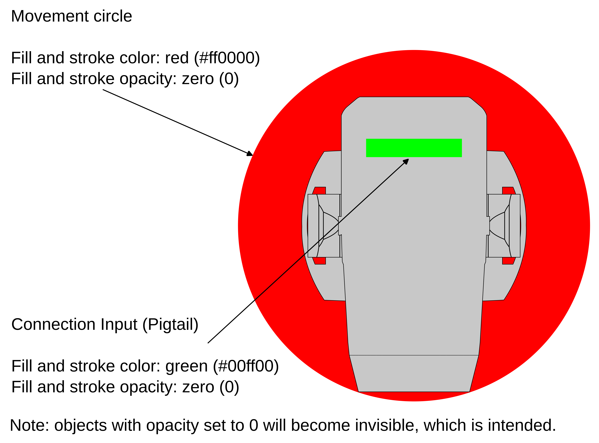
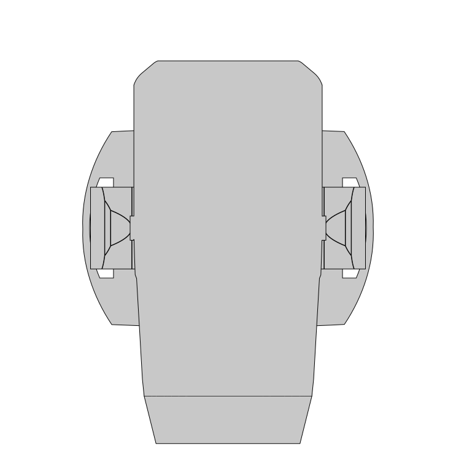

## Additional features inside SVG files

### SVG can define additional features:

* Movement Range: shapes inside the SVG with fill and stroke color Red (#FF0000
  (RGB: 255, 0, 0)) and with fill and stroke opacity 0, allow software to
  identify these shapes as a movement range of the device.

* Connection Input (Pigtail): shapes inside the SVG with fill and stroke color
  Green (#00FF00 (RGB: 0, 255, 0)) and with fill and stroke opacity 0, allow
  software to identify these shapes as a connection input (pigtail) part of the
  device.

SVG needs to be aligned with the GDTF 3D model. GDTF 3D front is down in SVG.

> Note: the opacity 0 is used for backwards compatibility

> Example: If Pigtail is at the back of the unit, is drawn up in SVG.

Attached examples:

