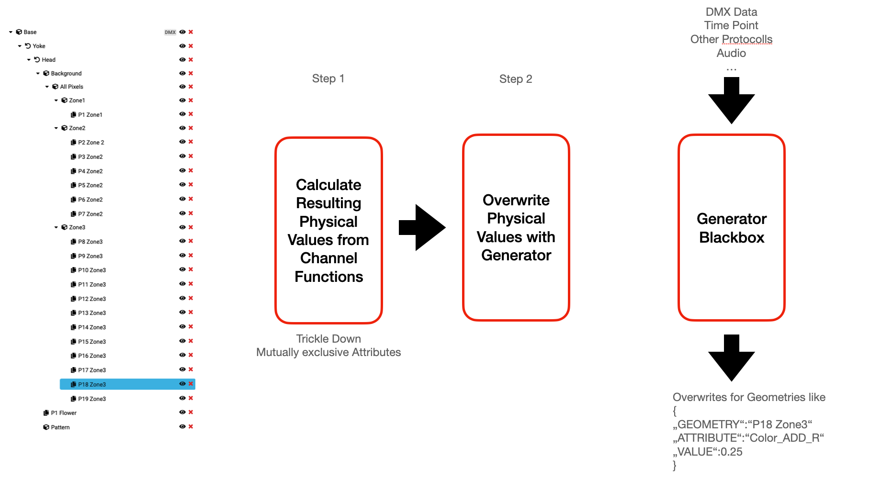

# Proposal for allowing defining non trivial fixture behavior like MultiLED and Macro behavior

## Linked Issues
https://github.com/mvrdevelopment/spec/issues/58
https://github.com/mvrdevelopment/spec/issues/203

## Problem
Fixtures with multiple LED have often have some kind of an effect engine build in, that allows to control the different LEDs, without the need to actually do all the programming on a console pixel by pixel.
A similar thing are fixture macros, that can playback specific effects of a fixture like changing colors and moving patterns.

For all of this behavior it is challenging to previsualize, as the actual behavior is triggered by one or multiple commands, but what actually happens is mostly unclear.

This proposal wants to add an approach to allow to define this behavior in such a way, that it can be visualized.

## Design Goals
- The approach needs to be fast. There could be thousands of devices where this patterns/effects need to be calculated. We need to have in mind that performance is crucial here. This said, it can be acceptable that we only do this for a selected count of devices, while the other are skipped.
- Manufacturers need to be able to provide the information in an easy and testable way. 
- When using the information on a console/visalizer, it needs to be safe and not compromise the running show.
- It need to be portable to different operating systems (Win, Mac, Linux) and architectures(arm, x86, x64).

## Solution

## Generator Modules

The idea that was produced back in 2022 was to add an API to GDTF, that allows to add additional `ChannelFunctions` to the GDTF and then control them via code. 

An sample of such an interface in in the [virtual_fixture.hxx](https://github.com/mvrdevelopment/spec/pull/127/files#diff-da40c861c6a3c4f7ac45148c94c474121411cb38422eb940ed4ca8f390720167) file.

The idea is that manufactures can compile the existing firmware into such an interface and so really can make sure that the visualization matches what the device is doing.

In order for this to work the following assumptions have been made:
1. You need to expose the DMX Data to the code of the fixture (When there are other protocolls that control the device, these also needs to be given.)
1. The geometry tree of the fixture can not be changed, and every Beam Geometry or other geometry that will be changed already needs to be there. 

The basic idea of the proposal is that first, the normal calculation of the `ChannelFunctions` of the GDTF, the `Generator Modules` also defines Attributes and physical values applied to the Geometries of the GDTF.

The process of this is explained in *Appendix A - Display of the Channel Functions and Generator modules*

To entertain this idea you need some kind of code execution. There are currently two proposals:

## Option 1 - WASM / LLVM Code

[WebAssembly](https://webassembly.org)
[emscripten](https://emscripten.org)

Multiple languages like C++, Rust, C#, Kotlin or AssemblyScript (a TypeScript-like syntax) can be compiled to WASM. 
This then can be executed in a virtual machine on the target. WASM code is platform independent. The execution speed can be compared with normal execution. 
Multithreading is possible using POSIX. Vectorization/SIMD is also possible.

The main advantage of approach is, that manufacturers can compile their firmware directly to WASM, as the C/C++ code can be compiled into wasm.

WASM is currently shipped in Firefox, Chrome, Safari and Edge.

## Option 2 - Shader language

An other option is to use shader languages like glsl. 

## Option 3 - Network approach

The generator could be a network protocol. Manufacturers could provide an App, or even just an web service that hosts the generators. The visualizer makes a network request to the generator.

The main advantage is that the actual technology used by the manufacturer is up to him self. We only define an interface.

In this case the generator code would also not be part of the GDTF file. 

## Questions
- When using a code approach, we need to think about a way to debug.

### Appendix A - Display of the Channel Functions and Generator modules

The following images show how Channel functions and Generator modules interact.

## Understanding Channel Functions

In GDTF, with Channel Functions you can control the physical data of geometries. The parent DMX Channel is linked to a geometry of the fixture. This ensures that only one Channel Functions inside the DMX Mode is controlling a Attribute for one given Geometry.

The physical From and To are now used to calculate the resulting physical value for the linked geometry.

An important part of this concept is the tickling down principle. So when you assign a physical value to a geometry, all child geometries of this also take over this value.

So when you set the head to the color red, all child geometries will also be considered to be red, unless another channel functions overwrites this value.

This scheme works well for direct controlled fixtures, so where the is one control per pixel / feature.

But for example Macro Channels or multi LED fixtures do not follow this approach and are therefor hard to visualize.

For LED Fixtures, there is often a concept of a foreground and background color for LED pixels. This do not will well into the controlling approach described above, as the assigning to for a pixel to be part of foreground / background can change over time. The normal parenting approach from GDTF here is not enough to fully describe this.

We want to overcome this with Generator Modules. This are parts of the system that calculate the physical values for geometries.

First the default calculation with the channel function is done. Then the generator modules will be calculated.

The input of the generator module can be:
- DMX Data
- Audio Data
- Time Point
- Other protocols
- ... (Any other signal that as impact on the functionality of the fixture)

The output if the Generator module, are multiple new physical values for given geometries that need to be visualized.