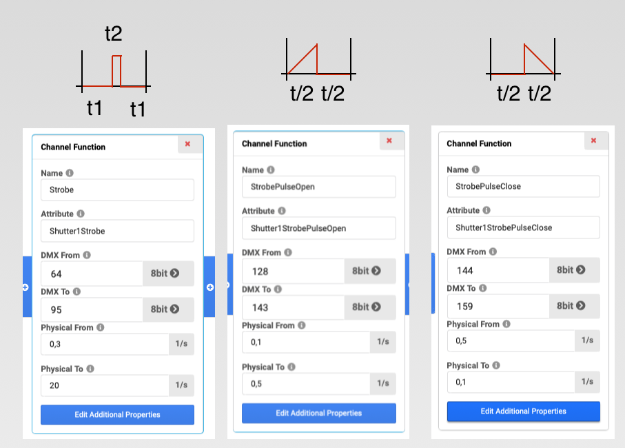

# Physical Attribute Enhancement Proposal

## Linked Issue

This Proposal implements the requirements of:

- TODO

# Problem



- Non linear Physical behavior in relation to DMX Value.

# Solution

## Current

Use Channel Set to interpolate

```
<DMXChannel DMXBreak="1" Default="32/1" Geometry="Head" Highlight="32/1" Offset="37">
<LogicalChannel Attribute="Shutter1" DMXChangeTimeLimit="0.000000" Master="None" MibFade="0.000000" Snap="No">
    <ChannelFunction Attribute="Shutter1Strobe" DMXFrom="64/1" Name="Strobe " OriginalAttribute="" PhysicalFrom="0.300000" PhysicalTo="20.000000" RealFade="0.000000">
        <ChannelSet DMXFrom="64/1" Name="Slow to fast 1/12" PhysicalFrom="1" PhysicalTo="1" WheelSlotIndex="0"/>
        <ChannelSet DMXFrom="67/1" Name="Slow to fast 2/12" PhysicalFrom="6" PhysicalTo="6" WheelSlotIndex="0"/>
</LogicalChannel>
</DMXChannel>
```


## Proposal 1

| XML Attribute Name | Value Type    |                                                                                                                                  
| ------------------ | ------------------------------------ | 


```
<DMXProfiles>
    <DmxProfile Name="Fance">
        <Pointe DMXPercent="0" Type=""Step" PhysicalPercent="0">
        <Pointe DMXPercent="0" Type=""Linear" PhysicalPercent="0">
        <Pointe DMXPercent="0" Type=""Spline" PhysicalPercent="0">
        <Pointe DMXPercent="0" Type=""Log" PhysicalPercent="0">
    </DmxProfile>
</Attributes>

<DMXChannel DMXBreak="1" Default="32/1" Geometry="Head" Highlight="32/1" Offset="37">
<LogicalChannel Attribute="Shutter1" DMXChangeTimeLimit="0.000000" Master="None" MibFade="0.000000" Snap="No">
    <ChannelFunction Attribute="Shutter1Strobe" DMXFrom="64/1" Name="Strobe " OriginalAttribute="" PhysicalFrom="0.300000" PhysicalTo="20.000000" RealFade="0.000000" DMXProfile="Fancy">
</LogicalChannel>
</DMXChannel>
```
