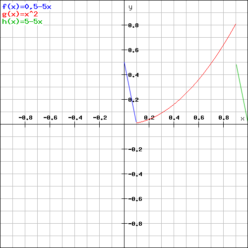

# Physical Attribute Enhancement Proposal

## Linked Issue

This Proposal implements the requirements of:

- Define DMXProfile for DMXProfiles https://github.com/mvrdevelopment/spec/issues/13

# Problem

Some Functions of a Device Non linear Physical behavior in relation to DMX Value.

# Solution

## Current

Use Channel Set to interpolate

```
<DMXChannel DMXBreak="1" Default="32/1" Geometry="Head" Highlight="32/1" Offset="37">
<LogicalChannel Attribute="Shutter1" DMXChangeTimeLimit="0.000000" Master="None" MibFade="0.000000" Snap="No">
    <ChannelFunction Attribute="Shutter1Strobe" DMXFrom="64/1" Name="Strobe " OriginalAttribute="" PhysicalFrom="0.300000" PhysicalTo="20.000000" RealFade="0.000000">
        <ChannelSet DMXFrom="64/1" Name="Slow to fast 1/12" PhysicalFrom="1" PhysicalTo="1" WheelSlotIndex="0"/>
        <ChannelSet DMXFrom="67/1" Name="Slow to fast 2/12" PhysicalFrom="6" PhysicalTo="6" WheelSlotIndex="0"/>
        ...
</LogicalChannel>
</DMXChannel>
```


## Proposal 1

We create a DMX Profile, that maps DMX Values to physical values using graphs. The DMX value is based on percentage of the DMX Range that is is assigned to.

The Physical Value is assigned to a Min / Max Value.

The following graph types are available:

| XML Attribute Name | Description                                                                                                                         |                                                                                                                                  
| ------------------ | -------------------------------------------------------------------------------------------------------------------------------------------- | 
| Linear             | Describes a linear interpolation between defined point and the the next point.                                                               |     
| Spline             | Describes a spline interpolation between defined point and the the next point. The f''(x) at start and end match the neighbor curves.        |         
| SplineBreakStart   | Describes a spline interpolation between defined point and the the next point. The f''(x) at the end match the neighbor curve.               |         
| SplineBreakEnd     | Describes a spline interpolation between defined point and the the next point. The f''(x) at the start match the neighbor curve.             | 
| StepStart          | Describes a jump to the next value and then a constant to the next point.                                                                    |         
| StepEnd            | Describes a constant to the next point and then a jump to the next value.                                                                    |         


The following example shows a DMX Profile:

```
<DMXProfiles>
    <DmxProfile Name="Fancy">
        <Point DMXPercent="0"   Type=""Linear" PhysicalPercent="50">
        <Point DMXPercent="10"  Type=""Linear" PhysicalPercent="0">
        <Point DMXPercent="30"  Type=""SplineBreakStart" PhysicalPercent="40">
        <Point DMXPercent="40"  Type=""Linear" PhysicalPercent="60">
        <Point DMXPercent="60"  Type=""SplineBreakEnd" PhysicalPercent="100">
        <Point DMXPercent="90"  Type=""Linear" PhysicalPercent="100">
        <Point DMXPercent="100" Type=""Linear" PhysicalPercent="50">
    </DmxProfile>
</DMXProfiles>
```

The resulting function would be the following



DMX Profiles can be assigned to Channel Functions.

| XML Attribute Name | Description                                                                                       |                                                                                                                                  
| ------------------ | ------------------------------------------------------------------------------------------------- | 
| DMXProfile         | Link to the DMX Profile. (optional)                                                               |  
| Min                | Minimum Physical Value that will be used for the DMX Profile. Default: Value from PhysicalFrom    |  
| Max                | Maximum Physical Value that will be used for the DMX Profile. Default: Value from PhysicalTo      |  

```
<DMXChannel DMXBreak="1" Default="32/1" Geometry="Head" Highlight="32/1" Offset="37">
    <LogicalChannel Attribute="Shutter1" DMXChangeTimeLimit="0.000000" Master="None" MibFade="0.000000" Snap="No">
        <ChannelFunction Attribute="Shutter1Strobe" DMXFrom="64/1" Name="Strobe " OriginalAttribute="" PhysicalFrom="100" PhysicalTo="100" RealFade="0.000000" DMXProfile="Fancy" Min="0" Max="200">
    </LogicalChannel>
</DMXChannel>
```
