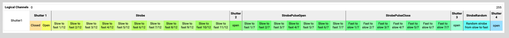

# Physical Attribute Enhancement Proposal


## Linked Issue

This Proposal implements the requirements of:

- Some attributes need more than one physical unit / physical value https://github.com/mvrdevelopment/GeneralDeviceTypeFormat/issues/126
- Strobe attributes needs more detailed physical description https://github.com/mvrdevelopment/GeneralDeviceTypeFormat/issues/130


# Problem


- Wheel Shake
- Strobe
- Iris
- Pos Shake
- Wheel Shake

# Solution

## Current

```
<DMXChannel DMXBreak="1" Default="32/1" Geometry="Head" Highlight="32/1" Offset="37">
<LogicalChannel Attribute="Shutter1" DMXChangeTimeLimit="0.000000" Master="None" MibFade="0.000000" Snap="No">
    <ChannelFunction Attribute="Shutter1Strobe" DMXFrom="64/1" Name="Strobe " OriginalAttribute="" PhysicalFrom="0.300000" PhysicalTo="20.000000" RealFade="0.000000">
        <ChannelSet DMXFrom="64/1" Name="Slow to fast 1/12" PhysicalFrom="0.409000" PhysicalTo="0.466000" WheelSlotIndex="0"/>
        <ChannelSet DMXFrom="67/1" Name="Slow to fast 2/12" PhysicalFrom="0.496000" PhysicalTo="0.539000" WheelSlotIndex="0"/>
        <ChannelSet DMXFrom="69/1" Name="Slow to fast 3/12" PhysicalFrom="0.590000" PhysicalTo="0.712000" WheelSlotIndex="0"/>
        <ChannelSet DMXFrom="72/1" Name="Slow to fast 4/12" PhysicalFrom="0.803000" PhysicalTo="1.042000" WheelSlotIndex="0"/>
        <ChannelSet DMXFrom="75/1" Name="Slow to fast 5/12" PhysicalFrom="1.227000" PhysicalTo="1.695000" WheelSlotIndex="0"/>
        <ChannelSet DMXFrom="79/1" Name="Slow to fast 6/12" PhysicalFrom="1.923000" PhysicalTo="3.390000" WheelSlotIndex="0"/>
        <ChannelSet DMXFrom="83/1" Name="Slow to fast 7/12" PhysicalFrom="4.545000" PhysicalTo="5.181000" WheelSlotIndex="0"/>
        <ChannelSet DMXFrom="86/1" Name="Slow to fast 8/12" PhysicalFrom="5.780000" PhysicalTo="6.579000" WheelSlotIndex="0"/>
        <ChannelSet DMXFrom="89/1" Name="Slow to fast 9/12" PhysicalFrom="7.042000" PhysicalTo="7.576000" WheelSlotIndex="0"/>
        <ChannelSet DMXFrom="92/1" Name="Slow to fast 10/12" PhysicalFrom="7.692000" PhysicalTo="8.065000" WheelSlotIndex="0"/>
        <ChannelSet DMXFrom="95/1" Name="Slow to fast 11/12" PhysicalFrom="8.333000" PhysicalTo="8.333000" WheelSlotIndex="0"/>
    </ChannelFunction>
    <ChannelFunction Attribute="Shutter1StrobePulseOpen" DMXFrom="128/1" Name="StrobePulseOpen" OriginalAttribute="" PhysicalFrom="0.100000" PhysicalTo="0.500000" RealFade="0.000000">
        <ChannelSet DMXFrom="128/1" Name="Slow to fast 1/7" PhysicalFrom="0.087000" PhysicalTo="0.087000" WheelSlotIndex="0"/>
        <ChannelSet DMXFrom="131/1" Name="Slow to fast 2/7" PhysicalFrom="0.087000" PhysicalTo="0.098000" WheelSlotIndex="0"/>
        <ChannelSet DMXFrom="133/1" Name="Slow to fast 3/7" PhysicalFrom="0.182000" PhysicalTo="0.182000" WheelSlotIndex="0"/>
        <ChannelSet DMXFrom="135/1" Name="Slow to fast 4/7" PhysicalFrom="0.274000" PhysicalTo="0.370000" WheelSlotIndex="0"/>
        <ChannelSet DMXFrom="137/1" Name="Slow to fast 5/7" PhysicalFrom="0.526000" PhysicalTo="0.667000" WheelSlotIndex="0"/>
        <ChannelSet DMXFrom="139/1" Name="Slow to fast 6/7" PhysicalFrom="0.804000" PhysicalTo="1.000000" WheelSlotIndex="0"/>
        <ChannelSet DMXFrom="141/1" Name="Slow to fast 7/7" PhysicalFrom="1.078000" PhysicalTo="1.471000" WheelSlotIndex="0"/>
    </ChannelFunction>
    <ChannelFunction Attribute="Shutter1StrobePulseClose" DMXFrom="144/1" Name="StrobePulseClose" OriginalAttribute="" PhysicalFrom="0.500000" PhysicalTo="0.100000" RealFade="0.000000">
        <ChannelSet DMXFrom="144/1" Name="Fast to slow 1/7" PhysicalFrom="1.471000" PhysicalTo="1.163000" WheelSlotIndex="0"/>
        <ChannelSet DMXFrom="146/1" Name="Fast to slow 2/7" PhysicalFrom="1.078000" PhysicalTo="1.000000" WheelSlotIndex="0"/>
        <ChannelSet DMXFrom="148/1" Name="Fast to slow 3/7" PhysicalFrom="0.804000" PhysicalTo="0.667000" WheelSlotIndex="0"/>
        <ChannelSet DMXFrom="150/1" Name="Fast to slow 4/7" PhysicalFrom="0.526000" PhysicalTo="0.370000" WheelSlotIndex="0"/>
        <ChannelSet DMXFrom="152/1" Name="Fast to slow 5/7" PhysicalFrom="0.274000" PhysicalTo="0.182000" WheelSlotIndex="0"/>
        <ChannelSet DMXFrom="154/1" Name="Fast to slow 6/7" PhysicalFrom="0.182000" PhysicalTo="0.098000" WheelSlotIndex="0"/>
        <ChannelSet DMXFrom="156/1" Name="Fast to slow 7/7" PhysicalFrom="0.087000" PhysicalTo="0.087000" WheelSlotIndex="0"/>
    </ChannelFunction>
</LogicalChannel>
</DMXChannel>
```


## Proposal 1

```
<Attributes>
    <Attribute Feature="Beam.Beam" MainAttribute="" Name="TimeOffset" PhysicalUnit="Time" Pretty="TimeOffset"/>
    <Attribute Feature="Beam.Beam" MainAttribute="" Name="Duration" PhysicalUnit="Time" Pretty="TimeOffset"/>
    <Attribute Feature="Beam.Beam" MainAttribute="" Name="CurveType" PhysicalUnit="Number" Pretty="CurveType"/>
</Attributes>

<DMXChannel DMXBreak="1" Default="32/1" Geometry="Head" Highlight="32/1" Offset="37">
<LogicalChannel Attribute="Shutter1" DMXChangeTimeLimit="0.000000" Master="None" MibFade="0.000000" Snap="No">
    <ChannelFunction Attribute="Shutter1Strobe" DMXFrom="64/1" Name="Strobe " OriginalAttribute="" PhysicalFrom="0.300000" PhysicalTo="20.000000" RealFade="0.000000">

        <ChannelSet DMXFrom="64/1" DMXTo="127/1" Attribute="Duration" Name="" PhysicalFrom="0.2" PhysicalTo="0.2"/>
        <ChannelSet DMXFrom="64/1" DMXTo="127/1" Attribute="TimeOffset" Name="" PhysicalFrom="0.4" PhysicalTo="0.4"/>

        <ChannelSet DMXFrom="64/1" Name="Slow to fast 1/12" PhysicalFrom="0.409000" PhysicalTo="0.466000" WheelSlotIndex="0"/>
        <ChannelSet DMXFrom="67/1" Name="Slow to fast 2/12" PhysicalFrom="0.496000" PhysicalTo="0.539000" WheelSlotIndex="0"/>
        <ChannelSet DMXFrom="69/1" Name="Slow to fast 3/12" PhysicalFrom="0.590000" PhysicalTo="0.712000" WheelSlotIndex="0"/>
        <ChannelSet DMXFrom="72/1" Name="Slow to fast 4/12" PhysicalFrom="0.803000" PhysicalTo="1.042000" WheelSlotIndex="0"/>
        <ChannelSet DMXFrom="75/1" Name="Slow to fast 5/12" PhysicalFrom="1.227000" PhysicalTo="1.695000" WheelSlotIndex="0"/>
        <ChannelSet DMXFrom="79/1" Name="Slow to fast 6/12" PhysicalFrom="1.923000" PhysicalTo="3.390000" WheelSlotIndex="0"/>
        <ChannelSet DMXFrom="83/1" Name="Slow to fast 7/12" PhysicalFrom="4.545000" PhysicalTo="5.181000" WheelSlotIndex="0"/>
        <ChannelSet DMXFrom="86/1" Name="Slow to fast 8/12" PhysicalFrom="5.780000" PhysicalTo="6.579000" WheelSlotIndex="0"/>
        <ChannelSet DMXFrom="89/1" Name="Slow to fast 9/12" PhysicalFrom="7.042000" PhysicalTo="7.576000" WheelSlotIndex="0"/>
        <ChannelSet DMXFrom="92/1" Name="Slow to fast 10/12" PhysicalFrom="7.692000" PhysicalTo="8.065000" WheelSlotIndex="0"/>
        <ChannelSet DMXFrom="95/1" Name="Slow to fast 11/12" PhysicalFrom="8.333000" PhysicalTo="8.333000" WheelSlotIndex="0"/>
    </ChannelFunction>
    <ChannelFunction Attribute="Shutter1StrobePulseOpen" DMXFrom="128/1" Name="StrobePulseOpen" OriginalAttribute="" PhysicalFrom="0.100000" PhysicalTo="0.500000" RealFade="0.000000">

        <ChannelSet DMXFrom="128/1" DMXTo="143/1" Attribute="Duration" Name="" PhysicalFrom="0.5" PhysicalTo="0.5"/>
        <ChannelSet DMXFrom="144/1" DMXTo="158/1" Attribute="CurveType" Name="" PhysicalFrom="1" PhysicalTo="1"/>

        <ChannelSet DMXFrom="128/1" Name="Slow to fast 1/7" PhysicalFrom="0.087000" PhysicalTo="0.087000" WheelSlotIndex="0"/>
        <ChannelSet DMXFrom="131/1" Name="Slow to fast 2/7" PhysicalFrom="0.087000" PhysicalTo="0.098000" WheelSlotIndex="0"/>
        <ChannelSet DMXFrom="133/1" Name="Slow to fast 3/7" PhysicalFrom="0.182000" PhysicalTo="0.182000" WheelSlotIndex="0"/>
        <ChannelSet DMXFrom="135/1" Name="Slow to fast 4/7" PhysicalFrom="0.274000" PhysicalTo="0.370000" WheelSlotIndex="0"/>
        <ChannelSet DMXFrom="137/1" Name="Slow to fast 5/7" PhysicalFrom="0.526000" PhysicalTo="0.667000" WheelSlotIndex="0"/>
        <ChannelSet DMXFrom="139/1" Name="Slow to fast 6/7" PhysicalFrom="0.804000" PhysicalTo="1.000000" WheelSlotIndex="0"/>
        <ChannelSet DMXFrom="141/1" Name="Slow to fast 7/7" PhysicalFrom="1.078000" PhysicalTo="1.471000" WheelSlotIndex="0"/>
    </ChannelFunction>
    <ChannelFunction Attribute="Shutter1StrobePulseClose" DMXFrom="144/1" Name="StrobePulseClose" OriginalAttribute="" PhysicalFrom="0.500000" PhysicalTo="0.100000" RealFade="0.000000">

        <ChannelSet DMXFrom="144/1" DMXTo="158/1" Attribute="Duration" Name="" PhysicalFrom="0.5" PhysicalTo="0.5"/>
        <ChannelSet DMXFrom="144/1" DMXTo="158/1" Attribute="CurveType" Name="" PhysicalFrom="1" PhysicalTo="1"/>

        <ChannelSet DMXFrom="144/1" Name="Fast to slow 1/7" PhysicalFrom="1.471000" PhysicalTo="1.163000" WheelSlotIndex="0"/>
        <ChannelSet DMXFrom="146/1" Name="Fast to slow 2/7" PhysicalFrom="1.078000" PhysicalTo="1.000000" WheelSlotIndex="0"/>
        <ChannelSet DMXFrom="148/1" Name="Fast to slow 3/7" PhysicalFrom="0.804000" PhysicalTo="0.667000" WheelSlotIndex="0"/>
        <ChannelSet DMXFrom="150/1" Name="Fast to slow 4/7" PhysicalFrom="0.526000" PhysicalTo="0.370000" WheelSlotIndex="0"/>
        <ChannelSet DMXFrom="152/1" Name="Fast to slow 5/7" PhysicalFrom="0.274000" PhysicalTo="0.182000" WheelSlotIndex="0"/>
        <ChannelSet DMXFrom="154/1" Name="Fast to slow 6/7" PhysicalFrom="0.182000" PhysicalTo="0.098000" WheelSlotIndex="0"/>
        <ChannelSet DMXFrom="156/1" Name="Fast to slow 7/7" PhysicalFrom="0.087000" PhysicalTo="0.087000" WheelSlotIndex="0"/>
    </ChannelFunction>
</LogicalChannel>
</DMXChannel>
```

## Proposal 2


```
<Attributes>
    <Attribute Feature="Beam.Beam" MainAttribute="Shutter1" Name="Shutter1Strobe" PhysicalUnit="Frequency" Pretty="Strobe1"/ Physical2Unit="Duration" Physical3Unit="TimeOffset">
    <Attribute Feature="Beam.Beam" MainAttribute="Shutter1" Name="Shutter1StrobePulseOpen" PhysicalUnit="Frequency" Pretty="Pulse Open1"/ PhysicalUnit="Frequency" Physical2Unit="Duration" Physical3Unit="CurveType">
    <Attribute Feature="Beam.Beam" MainAttribute="Shutter1" Name="Shutter1StrobePulseClose" PhysicalUnit="Frequency" Pretty="Pulse Close1"/ PhysicalUnit="Frequency" Physical2Unit="Duration" Physical3Unit="CurveType">
</Attributes>

<DMXChannel DMXBreak="1" Default="32/1" Geometry="Head" Highlight="32/1" Offset="37">
<LogicalChannel Attribute="Shutter1" DMXChangeTimeLimit="0.000000" Master="None" MibFade="0.000000" Snap="No">
    <ChannelFunction Attribute="Shutter1Strobe" DMXFrom="64/1" Name="Strobe " OriginalAttribute="" PhysicalFrom="0.300000" PhysicalTo="20.000000" RealFade="0.000000" Physical2From="0.2" Physical2To="0.2" Physical3From="0.4" Physical3To="0.4">
        <ChannelSet DMXFrom="64/1" Name="Slow to fast 1/12" PhysicalFrom="0.409000" PhysicalTo="0.466000" WheelSlotIndex="0"/>
        <ChannelSet DMXFrom="67/1" Name="Slow to fast 2/12" PhysicalFrom="0.496000" PhysicalTo="0.539000" WheelSlotIndex="0"/>
        <ChannelSet DMXFrom="69/1" Name="Slow to fast 3/12" PhysicalFrom="0.590000" PhysicalTo="0.712000" WheelSlotIndex="0"/>
        <ChannelSet DMXFrom="72/1" Name="Slow to fast 4/12" PhysicalFrom="0.803000" PhysicalTo="1.042000" WheelSlotIndex="0"/>
        <ChannelSet DMXFrom="75/1" Name="Slow to fast 5/12" PhysicalFrom="1.227000" PhysicalTo="1.695000" WheelSlotIndex="0"/>
        <ChannelSet DMXFrom="79/1" Name="Slow to fast 6/12" PhysicalFrom="1.923000" PhysicalTo="3.390000" WheelSlotIndex="0"/>
        <ChannelSet DMXFrom="83/1" Name="Slow to fast 7/12" PhysicalFrom="4.545000" PhysicalTo="5.181000" WheelSlotIndex="0"/>
        <ChannelSet DMXFrom="86/1" Name="Slow to fast 8/12" PhysicalFrom="5.780000" PhysicalTo="6.579000" WheelSlotIndex="0"/>
        <ChannelSet DMXFrom="89/1" Name="Slow to fast 9/12" PhysicalFrom="7.042000" PhysicalTo="7.576000" WheelSlotIndex="0"/>
        <ChannelSet DMXFrom="92/1" Name="Slow to fast 10/12" PhysicalFrom="7.692000" PhysicalTo="8.065000" WheelSlotIndex="0"/>
        <ChannelSet DMXFrom="95/1" Name="Slow to fast 11/12" PhysicalFrom="8.333000" PhysicalTo="8.333000" WheelSlotIndex="0"/>
    </ChannelFunction>
    <ChannelFunction Attribute="Shutter1StrobePulseOpen" DMXFrom="128/1" Name="StrobePulseOpen" OriginalAttribute="" PhysicalFrom="0.100000" PhysicalTo="0.500000" RealFade="0.000000" Physical2From="0.5" Physical2To="0.5" Physical3From="1" Physical3To="1">
        <ChannelSet DMXFrom="128/1" Name="Slow to fast 1/7" PhysicalFrom="0.087000" PhysicalTo="0.087000" WheelSlotIndex="0"/>
        <ChannelSet DMXFrom="131/1" Name="Slow to fast 2/7" PhysicalFrom="0.087000" PhysicalTo="0.098000" WheelSlotIndex="0"/>
        <ChannelSet DMXFrom="133/1" Name="Slow to fast 3/7" PhysicalFrom="0.182000" PhysicalTo="0.182000" WheelSlotIndex="0"/>
        <ChannelSet DMXFrom="135/1" Name="Slow to fast 4/7" PhysicalFrom="0.274000" PhysicalTo="0.370000" WheelSlotIndex="0"/>
        <ChannelSet DMXFrom="137/1" Name="Slow to fast 5/7" PhysicalFrom="0.526000" PhysicalTo="0.667000" WheelSlotIndex="0"/>
        <ChannelSet DMXFrom="139/1" Name="Slow to fast 6/7" PhysicalFrom="0.804000" PhysicalTo="1.000000" WheelSlotIndex="0"/>
        <ChannelSet DMXFrom="141/1" Name="Slow to fast 7/7" PhysicalFrom="1.078000" PhysicalTo="1.471000" WheelSlotIndex="0"/>
    </ChannelFunction>
    <ChannelFunction Attribute="Shutter1StrobePulseClose" DMXFrom="144/1" Name="StrobePulseClose" OriginalAttribute="" PhysicalFrom="0.500000" PhysicalTo="0.100000" RealFade="0.000000"  Physical2From="0.5" Physical2To="0.5" Physical3From="1" Physical3To="1">
        <ChannelSet DMXFrom="144/1" Name="Fast to slow 1/7" PhysicalFrom="1.471000" PhysicalTo="1.163000" WheelSlotIndex="0"/>
        <ChannelSet DMXFrom="146/1" Name="Fast to slow 2/7" PhysicalFrom="1.078000" PhysicalTo="1.000000" WheelSlotIndex="0"/>
        <ChannelSet DMXFrom="148/1" Name="Fast to slow 3/7" PhysicalFrom="0.804000" PhysicalTo="0.667000" WheelSlotIndex="0"/>
        <ChannelSet DMXFrom="150/1" Name="Fast to slow 4/7" PhysicalFrom="0.526000" PhysicalTo="0.370000" WheelSlotIndex="0"/>
        <ChannelSet DMXFrom="152/1" Name="Fast to slow 5/7" PhysicalFrom="0.274000" PhysicalTo="0.182000" WheelSlotIndex="0"/>
        <ChannelSet DMXFrom="154/1" Name="Fast to slow 6/7" PhysicalFrom="0.182000" PhysicalTo="0.098000" WheelSlotIndex="0"/>
        <ChannelSet DMXFrom="156/1" Name="Fast to slow 7/7" PhysicalFrom="0.087000" PhysicalTo="0.087000" WheelSlotIndex="0"/>
    </ChannelFunction>
</LogicalChannel>
</DMXChannel>
```


## Proposal 3


```
<Attributes>
    <Attribute Feature="Beam.Beam" MainAttribute="Shutter1" Name="Shutter1Strobe" PhysicalUnit="Frequency" Pretty="Strobe1">
        <SubPhysicalUnit type="Duration" default="20%">
        <SubPhysicalUnit type="TimeOffset" default="40%">
    </Attribute>
</Attributes>

<DMXChannel DMXBreak="1" Default="32/1" Geometry="Head" Highlight="32/1" Offset="37">
<LogicalChannel Attribute="Shutter1" DMXChangeTimeLimit="0.000000" Master="None" MibFade="0.000000" Snap="No">
    <ChannelFunction Attribute="Shutter1Strobe" DMXFrom="64/1" Name="Strobe " OriginalAttribute="" PhysicalFrom="0.300000" PhysicalTo="20.000000" RealFade="0.000000">
        <ChannelSet DMXFrom="64/1" Name="Slow to fast 1/12" PhysicalFrom="0.409000" PhysicalTo="0.466000" WheelSlotIndex="0"/>
        <ChannelSet DMXFrom="67/1" Name="Slow to fast 2/12" PhysicalFrom="0.496000" PhysicalTo="0.539000" WheelSlotIndex="0"/>
        <ChannelSet DMXFrom="69/1" Name="Slow to fast 3/12" PhysicalFrom="0.590000" PhysicalTo="0.712000" WheelSlotIndex="0"/>
        <ChannelSet DMXFrom="72/1" Name="Slow to fast 4/12" PhysicalFrom="0.803000" PhysicalTo="1.042000" WheelSlotIndex="0"/>
        <ChannelSet DMXFrom="75/1" Name="Slow to fast 5/12" PhysicalFrom="1.227000" PhysicalTo="1.695000" WheelSlotIndex="0"/>
        <ChannelSet DMXFrom="79/1" Name="Slow to fast 6/12" PhysicalFrom="1.923000" PhysicalTo="3.390000" WheelSlotIndex="0"/>
        <ChannelSet DMXFrom="83/1" Name="Slow to fast 7/12" PhysicalFrom="4.545000" PhysicalTo="5.181000" WheelSlotIndex="0"/>
        <ChannelSet DMXFrom="86/1" Name="Slow to fast 8/12" PhysicalFrom="5.780000" PhysicalTo="6.579000" WheelSlotIndex="0"/>
        <ChannelSet DMXFrom="89/1" Name="Slow to fast 9/12" PhysicalFrom="7.042000" PhysicalTo="7.576000" WheelSlotIndex="0"/>
        <ChannelSet DMXFrom="92/1" Name="Slow to fast 10/12" PhysicalFrom="7.692000" PhysicalTo="8.065000" WheelSlotIndex="0"/>
        <ChannelSet DMXFrom="95/1" Name="Slow to fast 11/12" PhysicalFrom="8.333000" PhysicalTo="8.333000" WheelSlotIndex="0"/>

        <SubChannelSet Name="This_describes_the_linear Duration" PhysicalFrom="0.01" PhysicalTo="10" SubPhysicalUnit="Duration" WheelSlotIndex="0"/>
        <SubChannelSet Name="This_describes_the_non_linear_Duty_Cycle" PhysicalFrom="10" PhysicalTo="90" SubPhysicalUnit="TimeOffset" DMXProfile="CurveDutyCycle" WheelSlotIndex="0"/>

    </ChannelFunction>
    <ChannelFunction Attribute="Shutter1StrobePulseOpen" DMXFrom="128/1" Name="StrobePulseOpen" OriginalAttribute="" PhysicalFrom="0.100000" PhysicalTo="0.500000" RealFade="0.000000">
        <ChannelSet DMXFrom="128/1" Name="Slow to fast 1/7" PhysicalFrom="0.087000" PhysicalTo="0.087000" WheelSlotIndex="0"/>
        <ChannelSet DMXFrom="131/1" Name="Slow to fast 2/7" PhysicalFrom="0.087000" PhysicalTo="0.098000" WheelSlotIndex="0"/>
        <ChannelSet DMXFrom="133/1" Name="Slow to fast 3/7" PhysicalFrom="0.182000" PhysicalTo="0.182000" WheelSlotIndex="0"/>
        <ChannelSet DMXFrom="135/1" Name="Slow to fast 4/7" PhysicalFrom="0.274000" PhysicalTo="0.370000" WheelSlotIndex="0"/>
        <ChannelSet DMXFrom="137/1" Name="Slow to fast 5/7" PhysicalFrom="0.526000" PhysicalTo="0.667000" WheelSlotIndex="0"/>
        <ChannelSet DMXFrom="139/1" Name="Slow to fast 6/7" PhysicalFrom="0.804000" PhysicalTo="1.000000" WheelSlotIndex="0"/>
        <ChannelSet DMXFrom="141/1" Name="Slow to fast 7/7" PhysicalFrom="1.078000" PhysicalTo="1.471000" WheelSlotIndex="0"/>
    </ChannelFunction>
    <ChannelFunction Attribute="Shutter1StrobePulseClose" DMXFrom="144/1" Name="StrobePulseClose" OriginalAttribute="" PhysicalFrom="0.500000" PhysicalTo="0.100000" RealFade="0.000000">
        <ChannelSet DMXFrom="144/1" Name="Fast to slow 1/7" PhysicalFrom="1.471000" PhysicalTo="1.163000" WheelSlotIndex="0"/>
        <ChannelSet DMXFrom="146/1" Name="Fast to slow 2/7" PhysicalFrom="1.078000" PhysicalTo="1.000000" WheelSlotIndex="0"/>
        <ChannelSet DMXFrom="148/1" Name="Fast to slow 3/7" PhysicalFrom="0.804000" PhysicalTo="0.667000" WheelSlotIndex="0"/>
        <ChannelSet DMXFrom="150/1" Name="Fast to slow 4/7" PhysicalFrom="0.526000" PhysicalTo="0.370000" WheelSlotIndex="0"/>
        <ChannelSet DMXFrom="152/1" Name="Fast to slow 5/7" PhysicalFrom="0.274000" PhysicalTo="0.182000" WheelSlotIndex="0"/>
        <ChannelSet DMXFrom="154/1" Name="Fast to slow 6/7" PhysicalFrom="0.182000" PhysicalTo="0.098000" WheelSlotIndex="0"/>
        <ChannelSet DMXFrom="156/1" Name="Fast to slow 7/7" PhysicalFrom="0.087000" PhysicalTo="0.087000" WheelSlotIndex="0"/>
    </ChannelFunction>
</LogicalChannel>
</DMXChannel>
```