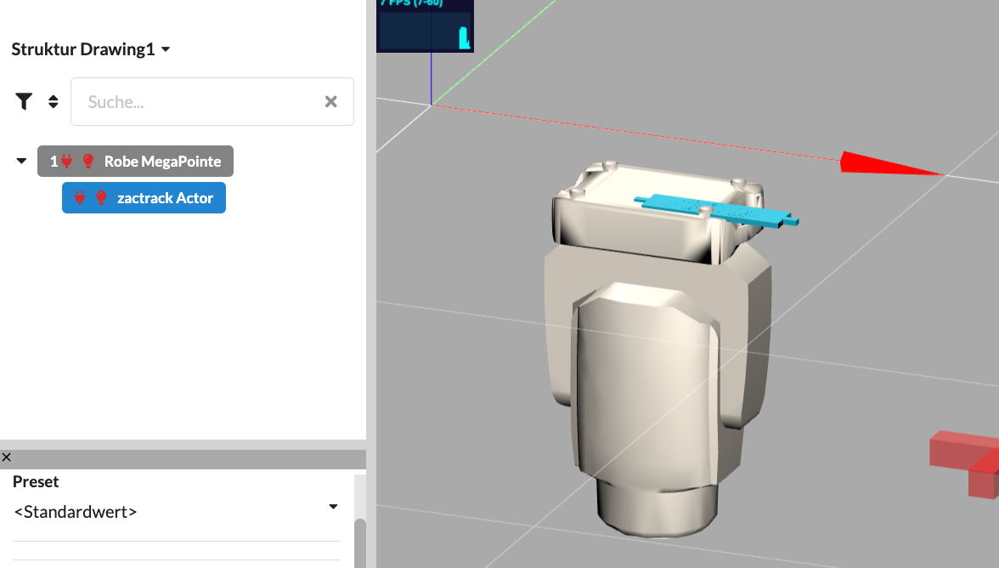

# Tracking Proposal

We will support tracking systems with new attributes. By default it is intended that the tracking info will be a child of the fixture it is for. This uses the Kinematic Chain feature from MVR.



On the control side, you can use the encoders to group the properties also of the child fixtures.


| Attribute  | Description  | What will happen in visualizers  | What the Physical Value will mean  |
|---|---|---|---|
| TrackerID  | Defines the tracker ID that be used as a target for the fixture.   | The fixture that is the parent of the tracker fixture, will point to the tracker with the given ID.   | The Physical Value will be interpreted as an integer ID with rounding.   |


```xml
   <AttributeDefinitions>  
       <ActivationGroups>  
           ... 
           <ActivationGroup  Name="Shaper" />  
       </ActivationGroups>  
       <FeatureGroups>  
        ...
           <FeatureGroup  Name="Tracking">  
               <Feature  Name="Tracking" />  
               <Feature  Name="TrackingControl" />  
           </FeatureGroup>  
       </FeatureGroups>  
       <Attributes>  
           <Attribute Name="TrackerID" Pretty="TID" Feature="Tracking.Tracking" PhysicalUnit="None"/>  
           <Attribute Name="TrackerCrossFade" Pretty="" Feature="Tracking.Tracking" PhysicalUnit="Percent"/>  
           <Attribute Name="TrackerTime" Pretty="Dim" Feature="Tracking.Tracking" PhysicalUnit="Time"/>  
           <Attribute Name="TrackerOffsetX" Pretty="Dim" Feature="Tracking.Tracking" PhysicalUnit="Length"/>  
           <Attribute Name="TrackerOffsetY" Pretty="Dim" Feature="Tracking.Tracking" PhysicalUnit="Length"/>  
           <Attribute Name="TrackerOffsetZ" Pretty="Dim" Feature="Tracking.Tracking" PhysicalUnit="Length"/>  
           <Attribute Name="TrackerMode" Pretty="Dim" Feature="Tracking.Tracking" PhysicalUnit="None"/>  

           <Attribute Name="TrackerControlHeight" Pretty="Dim" Feature="Tracking.TrackingControl" PhysicalUnit="Length"/>  
           <Attribute Name="TrackerControlSpeed" Pretty="Dim" Feature="Tracking.TrackingControl" PhysicalUnit="Speed"/>  
           <Attribute Name="TrackerControlFreeze" Pretty="Dim" Feature="Tracking.TrackingControl" PhysicalUnit="None"/>  
           <Attribute Name="TrackerControlBeamSize" Pretty="Dim" Feature="Tracking.TrackingControl" PhysicalUnit="Length"/>  
           <Attribute Name="TrackerControlMode" Pretty="Dim" Feature="Tracking.TrackingControl" PhysicalUnit="None"/>  

           <Attribute Name="TrackerControlShow" Pretty="Dim" Feature="Tracking.TrackingControl" PhysicalUnit="None"/>  
       </Attributes>  
   </AttributeDefinitions>
```