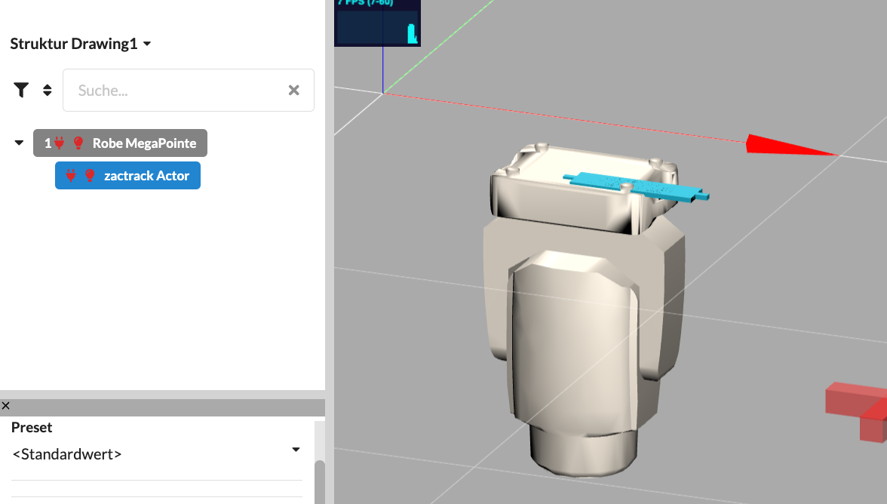
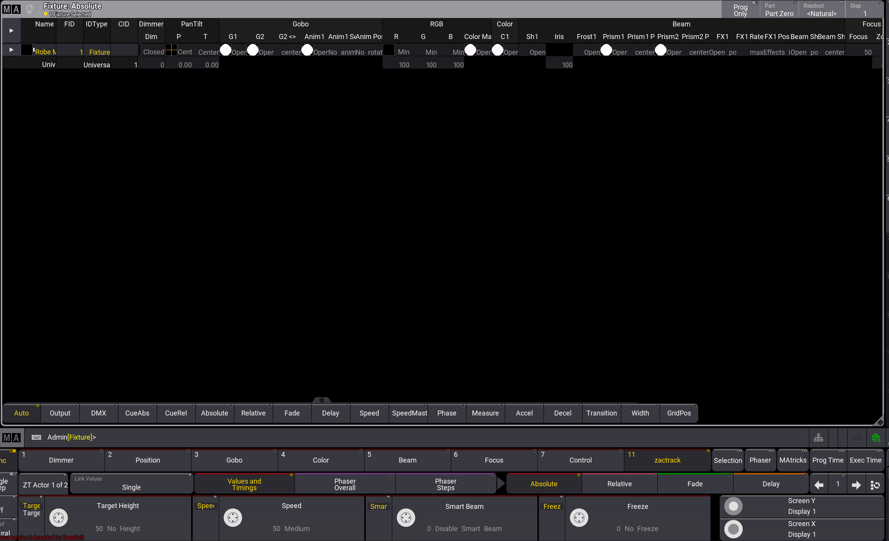

# Tracking Proposal

We will support tracking systems with new attributes. By default it is intended that the tracking info will be a child of the fixture it is for. This uses the Kinematic Chain feature from MVR.



On the control side, you can use the encoders to group the properties also of the child fixtures.



## Fixture Tracking Attributes

| Attribute               | Name | Description  | What will happen in visualizers  | What the Physical Value will mean  |
|-------------------------|------|---|---|---|
| TrackerID               | Actor/FocusPoint/Tracker ID     | Defines the tracker ID that be used as a target for the fixture.  Note1 | The fixture that is the parent of the tracker fixture, will point to the tracker with the given ID. See Note1| The Physical Value will be interpreted as an integer ID with rounding.   |
| TrackerCrossFade        | Cross Fade     | Defines how the value for the position and rotation of the device are calculated. 0% means fully from the device, 100% means fully from the tracker position.  |    |
| TrackerTime             | Transition Time     |   |    |
| TrackerOffsetX          | Beam Offset X     | Defines the offset in X direction the device will point in relation the actual tracker position.  |    | In the global coordinate system the tracking target will offsetted with in X direction.  | 
| TrackerOffsetY          | Beam Offset Y     | Defines the offset in Y direction the device will point in relation the actual tracker position.  |    | In the global coordinate system the tracking target will offsetted with in X direction.| 
| TrackerOffsetZ          | Beam Offset Z     | Defines the offset in Z direction the device will point in relation the actual tracker position.  |    | In the global coordinate system the tracking target will offsetted with in X direction. | 
| TrackerMode             | ? Mode     | Defines settings that you can make for the device and the tracker that is assigned to the device.  |    |

## Tracker Attributes

| Attribute               | Name | Description  | What will happen in visualizers  | What the Physical Value will mean  |
|-------------------------|------|---|---|---|
| TrackerControlHeight    |      | Allows to define the offset in Z direction that the tracker will have for all devices using this tracker for positioning.  |    |
| TrackerControlSpeed     |      | Defines how fast the device reacts to changes in the position of the tracker.  |    |
| TrackerControlFreeze    |      | Defines how accurate the device reacts to changes in the position of the tracker.  |    |
| TrackerControlBeamSize  |      | Defines how big the beam size for the fixture should be.   |    |
| TrackerControlMode      |      | Defines settings that you can make to the tracker.  |    |
| TrackerControlShow      |      | Defines settings that you can make to the show.  |    |


- Note1: Currently there is no "tracker" in MVR but we have concept of focus
  points, adding an integer id to the focus point would allow to select this
  focus point.

```xml
   <AttributeDefinitions>  
       <ActivationGroups>  
           ... 
           <ActivationGroup  Name="Tracking" />  
       </ActivationGroups>  
       <FeatureGroups>  
        ...
           <FeatureGroup  Name="Tracking">  
               <Feature  Name="Tracking" />  
               <Feature  Name="Actor" />  
           </FeatureGroup>  
       </FeatureGroups>  
       <Attributes>  
           <Attribute Name="TrackerID" Pretty="ID" Feature="Tracking.Fixture" PhysicalUnit="None"/>  
           <Attribute Name="TrackerCrossFade" Pretty="Cross Fade" Feature="Tracking.Fixture" PhysicalUnit="Percent"/>  
           <Attribute Name="TrackerTime" Pretty="Tine" Feature="Tracking.Fixture" PhysicalUnit="Time"/>  
           <Attribute Name="TrackerOffsetX" Pretty="Offset X" Feature="Tracking.Fixture" PhysicalUnit="Length"/>  
           <Attribute Name="TrackerOffsetY" Pretty="Offset Y" Feature="Tracking.Fixture" PhysicalUnit="Length"/>  
           <Attribute Name="TrackerOffsetZ" Pretty="Offset Z" Feature="Tracking.Fixture" PhysicalUnit="Length"/>  
           <Attribute Name="TrackerMode" Pretty="Mode" Feature="Tracking.Fixture" PhysicalUnit="None"/>  

           <Attribute Name="TrackerControlHeight" Pretty="Height" Feature="Tracking.FixtureControl" PhysicalUnit="Length"/>  
           <Attribute Name="TrackerControlSpeed" Pretty="Speed" Feature="Tracking.FixtureControl" PhysicalUnit="Speed"/>  
           <Attribute Name="TrackerControlFreeze" Pretty="Freeze" Feature="Tracking.FixtureControl" PhysicalUnit="Percent"/>  
           <Attribute Name="TrackerControlBeamSize" Pretty="Beam Size" Feature="Tracking.FixtureControl" PhysicalUnit="Length"/>  
           <Attribute Name="TrackerControlMode" Pretty="Control Mode" Feature="Tracking.FixtureControl" PhysicalUnit="None"/>  

           <Attribute Name="TrackerControlShow" Pretty="Show Mode" Feature="Tracking.FixtureControl" PhysicalUnit="None"/>  
       </Attributes>  
   </AttributeDefinitions>
```
